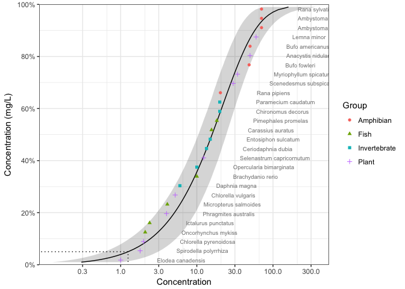

<!-- README.md is generated from README.Rmd. Please edit that file -->

<div id="devex-badge">

<a rel="Exploration" href="https://github.com/BCDevExchange/docs/blob/master/discussion/projectstates.md">
[](https://travis-ci.org/bcgov/ssdca)
[](https://codecov.io/github/bcgov/ssdca?branch=master)

# ssdca

`ssdca` is an R package to fit distributions to Species Sensitivity
Data. It is being developed for the B.C. Ministry of Environment by
[Poisson Consulting](https://github.com/poissonconsulting).

## Installation

To quickly install the latest version:

``` r
# install.packages("devtools")
devtools::install_github("bcgov/ssdca")
```

To install the latest version and build its vignette:

``` r
# install.packages("devtools")
devtools::install_github("bcgov/ssdca", force = TRUE, build_vignettes = TRUE)
```

To view the vignette

``` r
vignette("ssdca")
```

## Introduction

`ssdca` loads `fitdistrplus` and `ggplot2`, both of which it extends, as
well as several other packages.

``` r
library(ssdca)
#> Loading required package: VGAM
#> Loading required package: stats4
#> Loading required package: splines
#> Loading required package: ggplot2
#> Loading required package: fitdistrplus
#> Loading required package: MASS
#> Loading required package: survival
```

`ssdca` provides a data set for several chemicals including Boron.

``` r
boron_data
#> # A tibble: 28 x 5
#>    Chemical Species                  Conc Group        Units
#>    <chr>    <chr>                   <dbl> <fct>        <chr>
#>  1 Boron    Oncorhynchus mykiss      2.10 Fish         mg/L 
#>  2 Boron    Ictalurus punctatus      2.40 Fish         mg/L 
#>  3 Boron    Micropterus salmoides    4.10 Fish         mg/L 
#>  4 Boron    Brachydanio rerio       10.0  Fish         mg/L 
#>  5 Boron    Carassius auratus       15.6  Fish         mg/L 
#>  6 Boron    Pimephales promelas     18.3  Fish         mg/L 
#>  7 Boron    Daphnia magna            6.00 Invertebrate mg/L 
#>  8 Boron    Opercularia bimarginata 10.0  Invertebrate mg/L 
#>  9 Boron    Ceriodaphnia dubia      13.4  Invertebrate mg/L 
#> 10 Boron    Entosiphon sulcatum     15.0  Invertebrate mg/L 
#> # ... with 18 more rows
```

Multiple distributions can be fit using `ssd_fit_dists()`

``` r
boron_dists <- ssd_fit_dists(boron_data)
```

and plot using the `ggplot2` generic `autoplot`

``` r
theme_set(theme_bw()) # set plotting theme
autoplot(boron_dists)
#> Warning: Removed 588 rows containing missing values (geom_path).
#> geom_path: Each group consists of only one observation. Do you need to
#> adjust the group aesthetic?
```

<!-- -->

The goodness of fit can be assessed using `ssd_gof`

``` r
ssd_gof(boron_dists)
#> # A tibble: 6 x 7
#>   dist        ad     ks    cvm   aic  aicc   bic
#>   <chr>    <dbl>  <dbl>  <dbl> <dbl> <dbl> <dbl>
#> 1 lnorm    0.507 0.107  0.0703   239   240   242
#> 2 llog     0.487 0.0993 0.0595   241   241   244
#> 3 gompertz 0.602 0.120  0.0823   238   238   240
#> 4 lgumbel  0.829 0.158  0.134    244   245   247
#> 5 gamma    0.441 0.117  0.0555   238   238   240
#> 6 weibull  0.435 0.117  0.0543   238   238   240
```

and the model-averaged 5% hazard concentration estimated using `ssd_hc`

``` r
ssd_hc(boron_dists)
#> # A tibble: 99 x 5
#>    percent   est    se   lcl   ucl
#>      <int> <dbl> <dbl> <dbl> <dbl>
#>  1       1 0.304 0.344 0.127  1.09
#>  2       2 0.544 0.468 0.239  1.70
#>  3       3 0.780 0.570 0.355  2.24
#>  4       4 1.01  0.660 0.478  2.74
#>  5       5 1.25  0.744 0.606  3.21
#>  6       6 1.49  0.823 0.736  3.68
#>  7       7 1.73  0.899 0.871  4.16
#>  8       8 1.97  0.972 1.01   4.61
#>  9       9 2.21  1.04  1.15   5.06
#> 10      10 2.46  1.11  1.30   5.51
#> # ... with 89 more rows
```

Model-averaged predictions complete with confidence intervals can be
produced using the `stats` generic `predict`

``` r
boron_pred <- predict(boron_dists)
```

and plotted together with the original data using
`ssd_plot`.

``` r
ssd_plot(boron_data, boron_pred, shape = "Group", color = "Group", label = "Species",
         ylab = "Concentration (mg/L)")
#> Warning: Removed 98 rows containing missing values (geom_path).
#> geom_path: Each group consists of only one observation. Do you need to
#> adjust the group aesthetic?
```

<!-- -->

For more information and examples of how to use `ssdca` in conjuction
with `fitdistrplus` to assess alternative fits and deal with weighted
and censored data see the vignette `ssdca`. The vignette also
demonstrates how to use `ssdca` in conjunction with `ggplot2` to produce
custom plots.

A shiny webpage is being developed for non-users of R.

## Getting Help or Reporting an Issue

To report bugs/issues/feature requests, please file an
[issue](https://github.com/bcgov/ssdca/issues/).

## How to Contribute

If you would like to contribute to the package, please see our
[CONTRIBUTING](CONTRIBUTING.md) guidelines.

Please note that this project is released with a [Contributor Code of
Conduct](CODE_OF_CONDUCT.md). By participating in this project you agree
to abide by its terms.

## License

The code is released under the Apache License 2.0

    Copyright 2015 Province of British Columbia
    
    Licensed under the Apache License, Version 2.0 (the "License");
    you may not use this file except in compliance with the License.
    You may obtain a copy of the License at 
    
       http://www.apache.org/licenses/LICENSE-2.0
    
    Unless required by applicable law or agreed to in writing, software
    distributed under the License is distributed on an "AS IS" BASIS,
    WITHOUT WARRANTIES OR CONDITIONS OF ANY KIND, either express or implied.
    See the License for the specific language governing permissions and
    limitations under the License.

The data are licensed under the ([Open Government Licence -
Canada](http://open.canada.ca/en/open-government-licence-canada)). See
the `data-raw` folder for more information.
