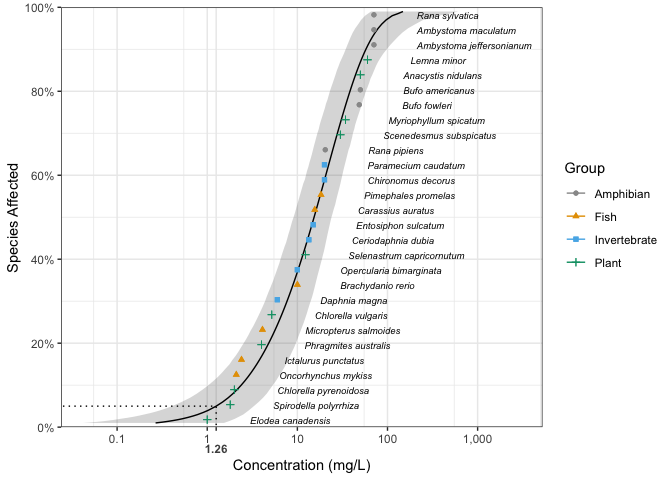

<!-- README.md is generated from README.Rmd. Please edit that file -->

# ssdtools 

[](https://github.com/BCDevExchange/docs/blob/master/discussion/projectstates.md)
[](https://travis-ci.org/bcgov/ssdtools)
[](https://codecov.io/github/bcgov/ssdtools?branch=master)
[](https://cran.r-project.org/package=ssdtools)

`ssdtools` is an R package to plot and fit Species Sensitivity
Distributions (SSD). Species sensitivity distributions are cumulative
probability distributions which are fitted to toxicity concentrations
for multiple species. The ssdtools package uses Maximum Likelihood to
fit log-normal, log-logistic, gompertz, lgumbel, gamma or weibull
distributions. Multiple distributions can be averaged using Information
Criteria. Confidence intervals are produced by bootstrapping.

## Installation

To install the latest version from CRAN

``` r
install.packages("ssdtools")
```

To install the latest development version:

``` r
install.packages("devtools")
devtools::install_github("bcgov/ssdtools")
```

To install the latest version development version and build its
vignettes:

``` r
install.packages("devtools")
devtools::install_github("bcgov/ssdtools", force = TRUE, build_vignettes = TRUE)
```

To see the available vignettes

``` r
vignette()
```

## Introduction

`ssdtools` loads `fitdistrplus` and `ggplot2`, both of which it extends,
as well as several other packages.

``` r
library(ssdtools)
#> Loading required package: VGAM
#> Loading required package: stats4
#> Loading required package: splines
#> Loading required package: ggplot2
#> Loading required package: fitdistrplus
#> Loading required package: MASS
#> Loading required package: survival
#> Loading required package: npsurv
#> Loading required package: lsei
```

`ssdtools` provides a data set for several chemicals including Boron.

``` r
boron_data
#> # A tibble: 28 x 5
#>    Chemical Species                  Conc Group        Units
#>    <chr>    <chr>                   <dbl> <fct>        <chr>
#>  1 Boron    Oncorhynchus mykiss       2.1 Fish         mg/L 
#>  2 Boron    Ictalurus punctatus       2.4 Fish         mg/L 
#>  3 Boron    Micropterus salmoides     4.1 Fish         mg/L 
#>  4 Boron    Brachydanio rerio        10   Fish         mg/L 
#>  5 Boron    Carassius auratus        15.6 Fish         mg/L 
#>  6 Boron    Pimephales promelas      18.3 Fish         mg/L 
#>  7 Boron    Daphnia magna             6   Invertebrate mg/L 
#>  8 Boron    Opercularia bimarginata  10   Invertebrate mg/L 
#>  9 Boron    Ceriodaphnia dubia       13.4 Invertebrate mg/L 
#> 10 Boron    Entosiphon sulcatum      15   Invertebrate mg/L 
#> # ... with 18 more rows
```

Multiple distributions can be fit using `ssd_fit_dists()`

``` r
boron_dists <- ssd_fit_dists(boron_data)
```

and plot using the `ggplot2` generic `autoplot`

``` r
theme_set(theme_bw()) # set plotting theme
autoplot(boron_dists)
```

<!-- -->

The goodness of fit can be assessed using `ssd_gof`

``` r
ssd_gof(boron_dists)
#> # A tibble: 6 x 9
#>   dist        ad     ks    cvm   aic  aicc   bic delta weight
#>   <chr>    <dbl>  <dbl>  <dbl> <dbl> <dbl> <dbl> <dbl>  <dbl>
#> 1 lnorm    0.507 0.107  0.0703  239.  240.  242. 1.42   0.133
#> 2 llog     0.487 0.0993 0.0595  241.  241.  244. 3.40   0.049
#> 3 gompertz 0.602 0.120  0.0822  238.  238.  240. 0      0.271
#> 4 lgumbel  0.829 0.158  0.134   244.  245.  247. 6.58   0.01 
#> 5 gamma    0.441 0.117  0.0555  238.  238.  240. 0.019  0.268
#> 6 weibull  0.435 0.117  0.0543  238.  238.  240. 0.014  0.269
```

and the model-averaged 5% hazard concentration estimated using `ssd_hc`

``` r
ssd_hc(boron_dists)
#> # A tibble: 1 x 5
#>   percent   est    se   lcl   ucl
#>     <int> <dbl> <dbl> <dbl> <dbl>
#> 1       5  1.25 0.751 0.598  3.29
```

Model-averaged predictions complete with confidence intervals can be
produced using the `stats` generic `predict`

``` r
boron_pred <- predict(boron_dists)
```

and plotted together with the original data using
`ssd_plot`.

``` r
ssd_plot(boron_data, boron_pred, shape = "Group", color = "Group", label = "Species",
         xlab = "Concentration (mg/L)")
```

<!-- -->

For more information and examples of how to use `ssdtools` in conjuction
with `fitdistrplus` to assess alternative fits and deal with weighted
and censored data see the vignette `ssdtools`. The vignette also
demonstrates how to use `ssdtools` in conjunction with `ggplot2` to
produce custom plots.

A shiny webpage developed by [Seb
Dalgaro](https://github.com/sebdalgarno) of Poisson Consulting for
non-users of R is available at
<https://poissonconsulting.shinyapps.io/ssdtools/>.

The data included in `ssdtools` are sourced from the Canadian
environmental quality guidelines [published by the Canadian Council of
Ministers of the Environment](http://ceqg-rcqe.ccme.ca/en/index.html).
See the `data-raw` folder for more
    information.

## Citation

    Warning in citation(package = "ssdtools"): no date field in DESCRIPTION
    file of package 'ssdtools'
    Warning in citation(package = "ssdtools"): could not determine year for
    'ssdtools' from package DESCRIPTION file
    
    To cite package 'ssdtools' in publications use:
    
      Joe Thorley and Carl Schwarz (NA). ssdtools: Species Sensitivity
      Distributions. R package version 0.0.2.9002.
      https://github.com/bcgov/ssdca
    
    A BibTeX entry for LaTeX users is
    
      @Manual{,
        title = {ssdtools: Species Sensitivity Distributions},
        author = {Joe Thorley and Carl Schwarz},
        note = {R package version 0.0.2.9002},
        url = {https://github.com/bcgov/ssdca},
      }

## Getting Help or Reporting an Issue

To report bugs/issues/feature requests, please file an
[issue](https://github.com/bcgov/ssdtools/issues/).

## How to Contribute

If you would like to contribute to the package, please see our
[CONTRIBUTING](CONTRIBUTING.md) guidelines.

Please note that this project is released with a [Contributor Code of
Conduct](CODE_OF_CONDUCT.md). By participating in this project you agree
to abide by its terms.

## License

The code is released under the Apache License 2.0

    Copyright 2015 Province of British Columbia
    
    Licensed under the Apache License, Version 2.0 (the "License");
    you may not use this file except in compliance with the License.
    You may obtain a copy of the License at 
    
       http://www.apache.org/licenses/LICENSE-2.0
    
    Unless required by applicable law or agreed to in writing, software
    distributed under the License is distributed on an "AS IS" BASIS,
    WITHOUT WARRANTIES OR CONDITIONS OF ANY KIND, either express or implied.
    See the License for the specific language governing permissions and
    limitations under the License.
