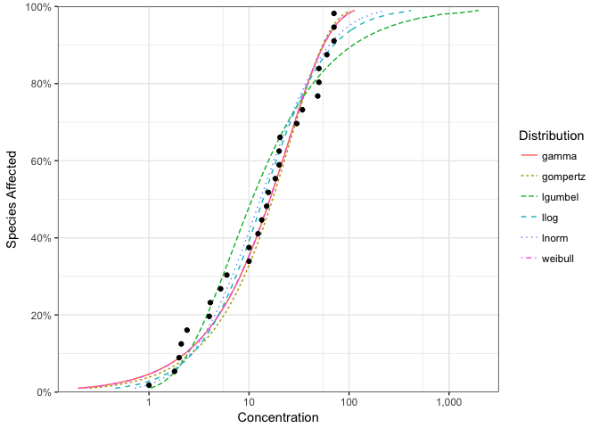
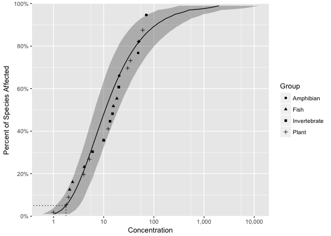

<!-- README.md is generated from README.Rmd. Please edit that file -->

<div id="devex-badge">

<a rel="Exploration" href="https://github.com/BCDevExchange/docs/blob/master/discussion/projectstates.md">
[](https://travis-ci.org/bcgov/ssdca)
[](https://codecov.io/github/bcgov/ssdca?branch=master)

# ssdca

`ssdca` is an R package to fit distributions to Species Sensitivity
Data. It is being developed for the B.C. Ministry of Environment by
[Poisson Consulting](https://github.com/poissonconsulting).

## Installation

To install the latest version:

``` r
# install.packages("devtools")
devtools::install_github("bcgov/ssdca")
```

## Introduction

`ssdca` loads `fitdistrplus`, which it extends, as well several other
packages.

``` r
library(ssdca)
#> Loading required package: actuar
#> 
#> Attaching package: 'actuar'
#> The following object is masked from 'package:grDevices':
#> 
#>     cm
#> Loading required package: VGAM
#> Loading required package: stats4
#> Loading required package: splines
#> 
#> Attaching package: 'VGAM'
#> The following objects are masked from 'package:actuar':
#> 
#>     dgumbel, dlgamma, dpareto, pgumbel, plgamma, ppareto, qgumbel,
#>     qlgamma, qpareto, rgumbel, rlgamma, rpareto
#> Loading required package: FAdist
#> 
#> Attaching package: 'FAdist'
#> The following objects are masked from 'package:VGAM':
#> 
#>     dgev, dgumbel, pgev, pgumbel, qgev, qgumbel, rgev, rgumbel
#> The following objects are masked from 'package:actuar':
#> 
#>     dgumbel, pgumbel, qgumbel, rgumbel
#> Loading required package: fitdistrplus
#> Loading required package: MASS
#> Loading required package: survival
#> 
#> Attaching package: 'ssdca'
#> The following object is masked from 'package:VGAM':
#> 
#>     AICc
```

`ssdca` provides a data set for several chemicals including Boron.

``` r
boron_data
#> # A tibble: 28 x 5
#>    Chemical                 Species Concentration        Group Units
#>       <chr>                   <chr>         <dbl>       <fctr> <chr>
#>  1    Boron     Oncorhynchus mykiss           2.1         Fish  mg/L
#>  2    Boron     Ictalurus punctatus           2.4         Fish  mg/L
#>  3    Boron   Micropterus salmoides           4.1         Fish  mg/L
#>  4    Boron       Brachydanio rerio          10.0         Fish  mg/L
#>  5    Boron       Carassius auratus          15.6         Fish  mg/L
#>  6    Boron     Pimephales promelas          18.3         Fish  mg/L
#>  7    Boron           Daphnia magna           6.0 Invertebrate  mg/L
#>  8    Boron Opercularia bimarginata          10.0 Invertebrate  mg/L
#>  9    Boron      Ceriodaphnia dubia          13.4 Invertebrate  mg/L
#> 10    Boron     Entosiphon sulcatum          15.0 Invertebrate  mg/L
#> # ... with 18 more rows
```

Multiple distributions can be fit using `ssd_fit_dists()`

``` r
boron_dists <- ssd_fit_dists(boron_data$Concentration)
```

and plot using the `ggplot2` generic `autoplot`

``` r
library(ggplot2)
autoplot(boron_dists)
```

<!-- -->

Model-averaged predictions complete with confidence intervals can be
produced using the `stats` generic.

``` r
boron_pred <- predict(boron_dists)
```

and plotted together with the original data using `ssd_plot` to produce
a publication quality plot.

``` r
ssd_plot(boron_data, boron_pred)
```

<!-- -->

For more information and examples of how to use `ssdca` in conjuction
with `fitdistrplus` and `ggplot2` to assess alternative fits and produce
custom plots is described in the vignette ssdca.

A shiny webpage is being developed for non-users of R.

## Getting Help or Reporting an Issue

To report bugs/issues/feature requests, please file an
[issue](https://github.com/bcgov/ssdca/issues/).

## How to Contribute

If you would like to contribute to the package, please see our
[CONTRIBUTING](CONTRIBUTING.md) guidelines.

Please note that this project is released with a [Contributor Code of
Conduct](CODE_OF_CONDUCT.md). By participating in this project you agree
to abide by its terms.

## License

The code is released under the Apache License 2.0

    Copyright 2015 Province of British Columbia
    
    Licensed under the Apache License, Version 2.0 (the "License");
    you may not use this file except in compliance with the License.
    You may obtain a copy of the License at 
    
       http://www.apache.org/licenses/LICENSE-2.0
    
    Unless required by applicable law or agreed to in writing, software
    distributed under the License is distributed on an "AS IS" BASIS,
    WITHOUT WARRANTIES OR CONDITIONS OF ANY KIND, either express or implied.
    See the License for the specific language governing permissions and
    limitations under the License.

The data are licensed under the ([Open Government Licence -
Canada](http://open.canada.ca/en/open-government-licence-canada)). See
the `data-raw` folder for more information.
