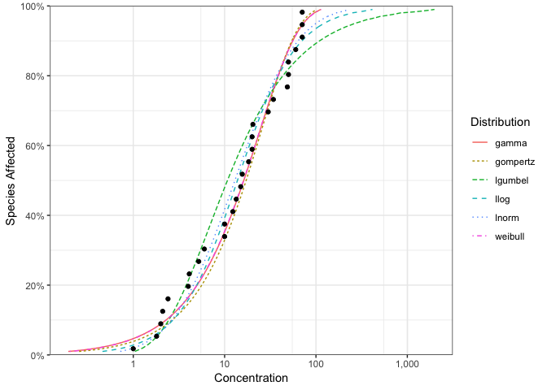
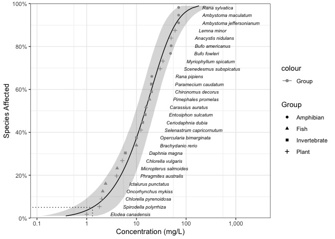

<!-- README.md is generated from README.Rmd. Please edit that file -->

# ssdtools 

<!-- badges: start -->

[](https://github.com/bcgov/repomountie/blob/master/doc/lifecycle-badges.md)
[](https://github.com/bcgov/ssdtools/actions/workflows/R-CMD-check.yaml)
[](https://app.codecov.io/github/bcgov/ssdtools?branch=main)
[](https://cran.r-project.org/package=ssdtools)

<!-- badges: end -->

`ssdtools` is an R package to fit and plot Species Sensitivity
Distributions (SSD).

SSDs are cumulative probability distributions which are fitted to
toxicity concentrations for different species as described by Posthuma
et al. (2001). The ssdtools package uses Maximum Likelihood to fit
distributions such as the gamma, log-Gumbel (identical to inverse
Weibull), log-logistic, log-normal and Weibull to censored and/or
weighted data. Multiple distributions can be averaged using Akaike
Information Criteria. Confidence intervals on hazard concentrations and
proportions are produced by parametric bootstrapping.

## Installation

To install the latest version from
[CRAN](https://CRAN.R-project.org/package=ssdtools)

``` r
install.packages("ssdtools")
```

To install the latest development version from
[GitHub](https://github.com/bcgov/ssdtools)

``` r
# install.packages("pak", repos = sprintf("https://r-lib.github.io/p/pak/stable/%s/%s/%s", .Platform$pkgType, R.Version()$os, R.Version()$arch))
pak::pak("bcgov/ssdtools")
```

## Introduction

`ssdtools` provides a data set for several chemicals including Boron.

``` r
library(ssdtools)
ssddata::ccme_boron
#> # A tibble: 28 × 5
#>    Chemical Species                  Conc Group        Units
#>    <chr>    <chr>                   <dbl> <fct>        <chr>
#>  1 Boron    Oncorhynchus mykiss       2.1 Fish         mg/L 
#>  2 Boron    Ictalurus punctatus       2.4 Fish         mg/L 
#>  3 Boron    Micropterus salmoides     4.1 Fish         mg/L 
#>  4 Boron    Brachydanio rerio        10   Fish         mg/L 
#>  5 Boron    Carassius auratus        15.6 Fish         mg/L 
#>  6 Boron    Pimephales promelas      18.3 Fish         mg/L 
#>  7 Boron    Daphnia magna             6   Invertebrate mg/L 
#>  8 Boron    Opercularia bimarginata  10   Invertebrate mg/L 
#>  9 Boron    Ceriodaphnia dubia       13.4 Invertebrate mg/L 
#> 10 Boron    Entosiphon sulcatum      15   Invertebrate mg/L 
#> # ℹ 18 more rows
```

Distributions are fit using `ssd_fit_dists()`

``` r
fits <- ssd_fit_dists(ssddata::ccme_boron)
```

and can be quickly plotted using `autoplot`

``` r
library(ggplot2)

theme_set(theme_bw())

autoplot(fits) +
  scale_colour_ssd()
```

<!-- -->

The goodness of fit can be assessed using `ssd_gof`

``` r
ssd_gof(fits)
#> # A tibble: 6 × 9
#>   dist           ad     ks    cvm   aic  aicc   bic delta weight
#>   <chr>       <dbl>  <dbl>  <dbl> <dbl> <dbl> <dbl> <dbl>  <dbl>
#> 1 gamma       0.440 0.117  0.0554  238.  238.  240. 0.005  0.357
#> 2 lgumbel     0.829 0.158  0.134   244.  245.  247. 6.56   0.013
#> 3 llogis      0.487 0.0994 0.0595  241.  241.  244. 3.39   0.066
#> 4 lnorm       0.507 0.107  0.0703  239.  240.  242. 1.40   0.177
#> 5 lnorm_lnorm 0.320 0.116  0.0414  240.  243.  247. 4.98   0.03 
#> 6 weibull     0.434 0.117  0.0542  238.  238.  240. 0      0.357
```

and the model-averaged 5% hazard concentration estimated by parametric
bootstrapping using `ssd_hc`

``` r
set.seed(99)
hc5 <- ssd_hc(fits, ci = TRUE, nboot = 100) # 100 bootstrap samples for speed
print(hc5)
#> # A tibble: 1 × 10
#>   dist    percent   est    se   lcl   ucl    wt method     nboot pboot
#>   <chr>     <dbl> <dbl> <dbl> <dbl> <dbl> <dbl> <chr>      <dbl> <dbl>
#> 1 average       5  1.24 0.741 0.510  3.35     1 parametric   100     1
```

Model-averaged predictions complete with confidence intervals can also
be estimated by parametric bootstrapping using the `stats` generic
`predict`. To perform bootstrapping for each distribution in parallel
register the future backend and then select the evaluation strategy.

``` r
doFuture::registerDoFuture()
future::plan(future::multisession)

set.seed(99)
boron_pred <- predict(fits, ci = TRUE)
```

and plotted together with the original data using `ssd_plot`.

``` r
ssd_plot(ssddata::ccme_boron, boron_pred,
  shape = "Group", color = "Group", label = "Species",
  xlab = "Concentration (mg/L)", ribbon = TRUE
) +
  expand_limits(x = 3000) +
  scale_colour_ssd()
```

<!-- -->

## References

Posthuma, L., Suter II, G.W., and Traas, T.P. 2001. Species Sensitivity
Distributions in Ecotoxicology. CRC Press.

## Information

Get started with ssdtools at
<https://bcgov.github.io/ssdtools/articles/ssdtools.html>.

A shiny app to allow non-R users to interface with ssdtools is available
at <https://github.com/bcgov/shinyssdtools>.

For the latest changes visit
[NEWS](https://bcgov.github.io/ssdtools/news).

The citation for the shiny app:

*Dalgarno, S. 2021. shinyssdtools: A web application for fitting Species
Sensitivity Distributions (SSDs). JOSS 6(57): 2848.
<https://joss.theoj.org/papers/10.21105/joss.02848>.*

The ssdtools package was developed as a result of earlier drafts of:

*Schwarz, C., and Tillmanns, A. 2019. Improving Statistical Methods for
Modeling Species Sensitivity Distributions. Province of British
Columbia, Victoria, BC.*

For recent developments in SSD modeling including a review of existing
software see:

*Fox, D.R., et al. 2021. Recent Developments in Species Sensitivity
Distribution Modeling. Environ Toxicol Chem 40(2): 293–308.
<https://doi.org/10.1002/etc.4925>.*

The CCME `data.csv` data file is derived from a factsheet prepared by
the [Canadian Council of Ministers of the
Environment](http://ceqg-rcqe.ccme.ca/en/index.html). See the
[`data-raw`](https://github.com/bcgov/ssdtools/tree/master/data-raw)
folder for more information.

## Getting Help or Reporting an Issue

To report bugs/issues/feature requests, please file an
[issue](https://github.com/bcgov/ssdtools/issues/).

## How to Contribute

If you would like to contribute to the package, please see our
[CONTRIBUTING](https://github.com/bcgov/ssdtools/blob/master/.github/CONTRIBUTING.md)
guidelines.

## Code of Conduct

Please note that the ssdtools project is released with a [Contributor
Code of
Conduct](https://contributor-covenant.org/version/2/1/CODE_OF_CONDUCT.html).
By contributing to this project, you agree to abide by its terms.

## Licensing

Copyright 2023 Province of British Columbia, Environment and Climate
Change Canada, and Australian Government Department of Climate Change,
Energy, the Environment and Water

The documentation is released under the [CC BY 4.0
License](https://creativecommons.org/licenses/by/4.0/)

The code is released under the [Apache License
2.0](https://www.apache.org/licenses/LICENSE-2.0)
