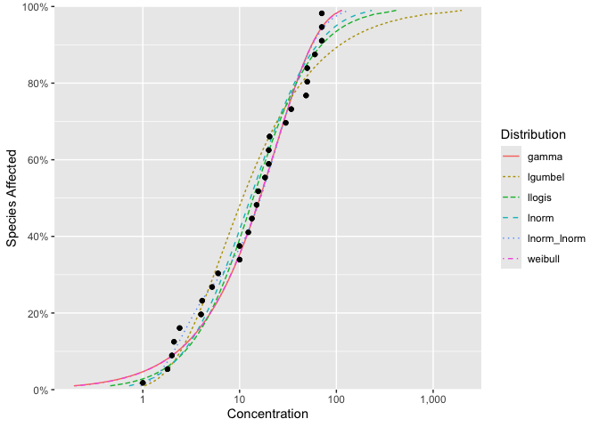

<!-- README.md is generated from README.Rmd. Please edit that file -->

# ssdtools 

<!-- badges: start -->

[](https://lifecycle.r-lib.org/articles/stages.html#stable)
[](https://github.com/bcgov/ssdtools/actions/workflows/R-CMD-check.yaml)
[](https://app.codecov.io/gh/bcgov/ssdtools)
[](https://cran.r-project.org/package=ssdtools)

<!-- badges: end -->

`ssdtools` is an R package to fit and plot Species Sensitivity
Distributions (SSD).

SSDs are cumulative probability distributions which are fitted to
toxicity concentrations for different species as described by Posthuma
et al. (2001). The ssdtools package uses Maximum Likelihood to fit
distributions such as the log-normal, log-logistic, log-Gumbel (also
known as the inverse Weibull), gamma, Weibull and log-normal log-normal
mixture. Multiple distributions can be averaged using Akaike Information
Criteria. Confidence intervals on hazard concentrations and proportions
are produced by bootstrapping.

## Installation

To install the latest release version from
[CRAN](https://CRAN.R-project.org/package=ssdtools).

``` r
install.packages("ssdtools")
```

To install the latest development version from
[r-universe](https://bcgov.r-universe.dev/ssdtools).

``` r
install.packages("ssdtools", repos = c("https://bcgov.r-universe.dev", "https://cloud.r-project.org"))
```

or from [GitHub](https://github.com/bcgov/ssdtools)

``` r
# install.packages("pak", repos = sprintf("https://r-lib.github.io/p/pak/stable/%s/%s/%s", .Platform$pkgType, R.Version()$os, R.Version()$arch))
pak::pak("bcgov/ssdtools")
```

## Introduction

The dependency [`ssddata`](https://github.com/open-AIMS/ssddata)
provides example data sets for several chemicals including Boron.

``` r
library(ssdtools)
ssddata::ccme_boron
#> # A tibble: 28 × 5
#>    Chemical Species                  Conc Group        Units
#>    <chr>    <chr>                   <dbl> <fct>        <chr>
#>  1 Boron    Oncorhynchus mykiss       2.1 Fish         mg/L 
#>  2 Boron    Ictalurus punctatus       2.4 Fish         mg/L 
#>  3 Boron    Micropterus salmoides     4.1 Fish         mg/L 
#>  4 Boron    Brachydanio rerio        10   Fish         mg/L 
#>  5 Boron    Carassius auratus        15.6 Fish         mg/L 
#>  6 Boron    Pimephales promelas      18.3 Fish         mg/L 
#>  7 Boron    Daphnia magna             6   Invertebrate mg/L 
#>  8 Boron    Opercularia bimarginata  10   Invertebrate mg/L 
#>  9 Boron    Ceriodaphnia dubia       13.4 Invertebrate mg/L 
#> 10 Boron    Entosiphon sulcatum      15   Invertebrate mg/L 
#> # ℹ 18 more rows
```

The six default distributions are fit using `ssd_fit_dists()`

``` r
fits <- ssd_fit_dists(ssddata::ccme_boron)
```

and can be quickly plotted using `autoplot`

``` r
autoplot(fits)
```



The goodness of fit can be assessed using `ssd_gof`

``` r
ssd_gof(fits)
#> # A tibble: 6 × 9
#>   dist           ad     ks    cvm   aic  aicc   bic delta weight
#>   <chr>       <dbl>  <dbl>  <dbl> <dbl> <dbl> <dbl> <dbl>  <dbl>
#> 1 gamma       0.440 0.117  0.0554  238.  238.  240. 0.005  0.357
#> 2 lgumbel     0.829 0.158  0.134   244.  245.  247. 6.56   0.013
#> 3 llogis      0.487 0.0994 0.0595  241.  241.  244. 3.39   0.066
#> 4 lnorm       0.507 0.107  0.0703  239.  240.  242. 1.40   0.177
#> 5 lnorm_lnorm 0.320 0.116  0.0414  240.  243.  247. 4.98   0.03 
#> 6 weibull     0.434 0.117  0.0542  238.  238.  240. 0      0.357
```

and the model-averaged 5% hazard concentration estimated (with
bootstrapping to get confidence intervals) using `ssd_hc`.

``` r
set.seed(99)
hc5 <- ssd_hc(fits, ci = TRUE)
print(hc5)
#> # A tibble: 1 × 11
#>   dist    proportion   est    se   lcl   ucl    wt method    nboot pboot samples
#>   <chr>        <dbl> <dbl> <dbl> <dbl> <dbl> <dbl> <chr>     <dbl> <dbl> <I<lis>
#> 1 average       0.05  1.26 0.782 0.407  3.29     1 parametr…  1000     1 <dbl>
```

Model-averaged predictions complete with confidence intervals can also
be estimated by parametric bootstrapping using the `stats` generic
`predict`.

``` r
boron_pred <- predict(fits, ci = TRUE)
```

The predictions can be plotted together with the original data using
`ssd_plot`.

``` r
library(ggplot2)

theme_set(theme_bw())

ssd_plot(ssddata::ccme_boron, boron_pred,
  shape = "Group", color = "Group", label = "Species",
  xlab = "Concentration (mg/L)", ribbon = TRUE
) +
  expand_limits(x = 3000) +
  scale_colour_ssd()
```


## Information

Get started with ssdtools at
<https://bcgov.github.io/ssdtools/articles/ssdtools.html>.

A shiny app to allow non-R users to interface with ssdtools is available
at <https://github.com/bcgov/shinyssdtools>.

For the latest changes to the development version see the
[NEWS](https://bcgov.github.io/ssdtools/news/) file.

For recent developments in SSD modeling including a review of existing
software see:

*Fox, D.R., et al. 2021. Recent Developments in Species Sensitivity
Distribution Modeling. Environ Toxicol Chem 40(2): 293–308.
<https://doi.org/10.1002/etc.4925>.*

### Getting Help or Reporting an Issue

To report bugs/issues/feature requests, please file an
[issue](https://github.com/bcgov/ssdtools/issues/).

### Contribution

If you would like to contribute to the package, please see our
[CONTRIBUTING](https://github.com/bcgov/ssdtools/blob/master/.github/CONTRIBUTING.md)
guidelines.

### Code of Conduct

Please note that the ssdtools project is released with a [Contributor
Code of
Conduct](https://contributor-covenant.org/version/2/1/CODE_OF_CONDUCT.html).
By contributing to this project, you agree to abide by its terms.

## References

Posthuma, L., Suter II, G.W., and Traas, T.P. 2001. Species Sensitivity
Distributions in Ecotoxicology. CRC Press.

<div id="refs">

</div>

## Licensing

Copyright 2018-2024 Province of British Columbia  
Copyright 2021 Environment and Climate Change Canada  
Copyright 2023-2024 Australian Government Department of Climate Change,
Energy, the Environment and Water

The documentation is released under the [CC BY 4.0
License](https://creativecommons.org/licenses/by/4.0/)

The code is released under the [Apache License
2.0](https://www.apache.org/licenses/LICENSE-2.0)
