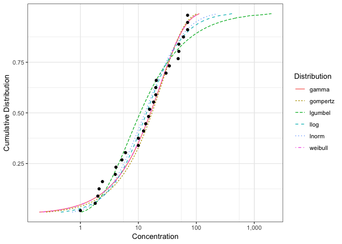

# Summary

Species sensitivity distributions (SSDs) are cumulative probability distributions which are fitted to toxicity concentrations for multiple species (Figure 1). 
They are used for the derivation of environmental quality criteria and ecological risk assessment for contaminated ecosystems [@posthuma_species_2001].

`ssdtools` is an R package [@r] to fit log-normal (lnorm), log-logistic (llog), Gompertz, log-Gumbel (lgumbel), gamma or Weibull distributions to species concentration data.

The user can also define their own distributions.
Multiple distributions can be averaged using Information Criteria [@burnham_model_2002].
The available Information Criteria are the Akaike Information Criterion (AIC), the Akaike Information Criterion corrected for small sample size (AICc) and Bayesian Information Criterion (BIC).
Confidence intervals can be calculated for the fitted cumulative distribution function or specific hazard concentrations (percentiles).
The confidence intervals are currently produced by parametric bootstrap resampling.

`ssdtools` loads the `fitdistrplus` R package [@fitdistrplus] upon which it depends for model fitting, calculation of AIC and bootstrapping.
`ssdtools` also loads the `ggplot2` R package [@ggplot2] which it extends by defining `ssdfit`, `xribbon` and `hcintersect` geometries to allow the user to produce custom SSD plots.

Development of `ssdtools` was funded by the Ministry of Environment and Climate Change Strategy, British Columbia.

The software archive is at <https://github.com/bcgov/ssdtools>.

# References
