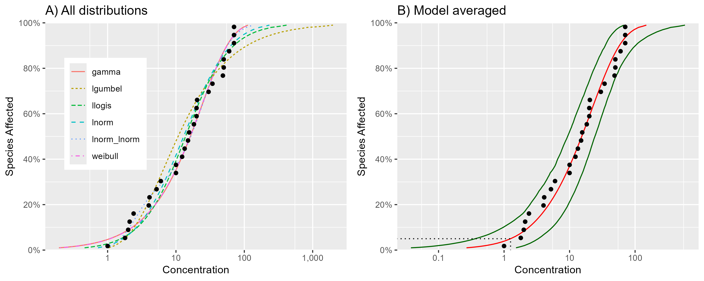

# Summary

Species sensitivity distributions (SSDs) are cumulative probability distributions that are used to estimate the percent of species that are affected by a given concentration of a chemical. 

The concentration that affects x% of the species is referred to as the Hazard Concentration (*HCx*), and these are used for the derivation of environmental quality criteria and ecological risk assessment for contaminated ecosystems [@posthuma_species_2001].

`ssdtools` [@thorley2018ssdtools] is an R package [@r] to fit SSDs using Maximum Likelihood [@millar_maximum_2011] and provide estimates of Hazard Concentration (HC) and Hazard Protection (HP) using single distributions, as well as a multi-distribution set via model averaging. 

Here we report on a major new version of the `sstools` R package now based on `TMB` which provides additional distributions, implements critical updates to ensure that *HCx* and *HCp* estimates satisfy the *inversion principle*, and provides bootstrap methods to obtain confidence intervals which are unbiased have appropriate coverage.

# Statement of need

The SSD is a statistical approach that is used to estimate either the concentration
of a chemical that is hazardous to no more than x% of all species (*HCx*), or the proportion of species potentially affected by a given concentration (x) of a chemical (*HCp*). SSDs remain a practical tool for the determination of safe threshold
concentrations for toxicants in fresh and marine waters, and are implemented in some form for risk assessment and water quality criteria derivation throughout multiple jurisdictions globally (@lepper2005manual; @Warne2018; @bcmecc2019; @USEPA2020).

The concentration that affects 5% of the species is referred to as the 5% Hazard Concentration (*HC5*).
Hazard concentrations are used for the derivation of environmental quality criteria and ecological risk assessment for contaminated ecosystems [@posthuma_species_2001].

The selection of a suitable probability model has been identified as one of the most important and difficult choices in the use of SSDs [@chapman_2007]. `ssdtools` uses model averaging to allow estimation of *HCx* and *HPx* values using an ensemble of plausible candidate distributions, thereby avoiding the need for selection of a single a distribution. The method, as applied in the SSD context is described in detail in [@fox_recent_2021], and provides a level of flexibility and parsimony that is difficult to achieve with a single SSD distribution.

# Technical details

A range of distributions are available in `ssdtools`. The original implementation [@thorley2018ssdtools] included the log-normal (lnorm), log-logistic (llogis), Gompertz (gompertz), log-Gumbel (lgumbel, also known as the inverse Weibull), gamma and weibull distributions. This has since been updated to include the Burr Type 3 (burrIII3) and inverse Pareto (invpareto) distributions as underlying distributions (along with the inverse Weibull) of the SSD fitting software `Burrlioz` [@barry2012burrlioz]. In addition, two mixture distributions (llogis_llogis and lnorm_lnorm) have been implemented as a means of accommodating bimodality [@fox_recent_2021]. `ssdtools` will fit the gamma, lgumbel, llogis, lnorm, lnorm_lnorm and weibull distributions as a standard set of stable default distributions. 

The revised version of `ssdtools` has moved from the `fitdistrplus` R package [@fitdistrplus] to `TMB` [@tmb] for fitting the available distributions via Maximum Likelihood. The move to `TMB` allows more control over model specification,
transparency regarding convergence criteria and better assessment of numerical instability issues. 

In both the original [@thorley2018ssdtools] and revised versions of `ssdtools` model selection or model averaging across distributions can be performed using Akaike Information Criterion (AIC), AIC corrected for small sample size (AICc) and Bayesian Information Criterion (BIC) [@burnham_model_2002]. 

By default `ssddtools` uses AICc based model weights for model averaging. The original implementation [@thorley2018ssdtools] used a weighted arithmetic average to achieve model averaging: \[\bar{X}=\sum\limits_{i=1}^{n}{{{w}_{i}}{{X}_{i}}}\] with $0\le {{w}_{i}}\le 1$ and $\sum\limits_{i=1}^{n}{{{w}_{i}}=1}$. This approach is widely adopted for model averaging in the context of estimating model parameters or quantities derived from a fitted model. However, in the context of SSD modelling calculating weighted arithmetic means of *HCx* and *HCp* results in estimates that fail to satisfy the *inversion principle* (see details in @fox_methodologies_2024). The revised version of `ssdtools` (version 2.0) treats the candidate distribution ensemble as a proper *cumulative distribution function* (cdf) given by the expression: $$G\left( x \right) = \sum\limits_{i = 1}^k {{w_i}} {F_i}\left( x \right)$$
where ${F_i}\left(  \cdot  \right)$ is the *i^th^* component SSD (i.e. *cdf*) and *w~i~* is the AIC(c) based model weight assigned to ${F_i}\left(  \cdot  \right)$. *HCx* and *HCp* estimates are obtained from this joint cdf via finding a solution to the following equation:$${x:G\left( x \right) = p}$$ or, equivalently:$$x:G\left( x \right) - p = 0$$ for some fraction affected, $p$. Finding the solution to this last equation is referred to as *finding the root(s)* of the function $G\left( x \right)$. In `R` finding the roots of $x:G\left( x \right) - p = 0$ is achieved using the `uniroot()` function.

`ssddtools` finds the confidence intervals (CIs) for the cumulative distribution or specific hazard concentrations/probabilities (*HCx* and *HCp*) via parametric bootstrapping, which has been shown to have better coverage than the equivalent non parametric approach used in other SSD modelling software, such as `Burrlioz` (see @fox_methodologies_2021). As for the *HC/HP* point estimates, the original implementation of ssdtools [@thorley2018ssdtools] used a weighted arithmetic average of the individual candidate distribution CIs to obtain model weighted CI values. This approach has been shown to have poor coverage [@fox_methodologies_2024] and is inconsistent with the new approach for deriving point estimates for *HC/HP* based on the AICc weighted joint cdf described above. The revised version of `ssdtools` (version 2.0) implements a parametric bootstrapping procedure that samples from the AICc weighted ensemble of distributions, re-fits the sample data, and subsequently solves for *HC/HP* based on the newly fitted AICc weighted joint cdf (see details in @fox_methodologies_2024). This procedure can be carried out with and without re-estimation of the AICc weights. In addition, an alternative computationally faster approach based on a weighted sample of the individual candidate bootstrap estimates is also implemented, and has been shown to have high coverage and similar *HCx* confidence interval estimates [@fox_methodologies_2024].

In addition  to fitting SSDs and providing methods for estimating *HC/HP* values, `ssdtools` extends the `ggplot2` R package [@ggplot2] by defining `ssdfit`, `xribbon` and `hcintersect` geometries to allow the user to produce custom SSD plots.

# Example of use

The following code fits the default distributions to the boron example data set from `ssddata` [@ssddata]:

```r
# install.packages("ssdtools")
library(ssdtools)
dists <- ssd_fit_dists(ssddata::ccme_boron)
```
HC estimates can be obtained via:

```r
hc <- ssd_hc(dists)
```

We can plot all of the input distributions via:
```r
library(ggplot2)
plot_dists <- autoplot(dists) +
  ggtitle(label="A) All distributions") +  
  theme(legend.title=element_blank()) +
  theme(legend.position = c(0.2, 0.6))
```
The model averaged cdf can be plotted along with the bootstrapped CIs, and the model averaged 5% HC as a dotted intersection via:

```r
pred <- ssdtools::predict(dists, ci = TRUE, weighted = TRUE, multi_ci = FALSE)
plot_averaged <- ssd_plot(ssddata::ccme_boron, pred, 
                          hc = 0.05, ci = TRUE) +
  ggtitle(label="B) Model averaged")
```
These plot's can be arranged together like any `ggplot2` object via `ggpubr` [@ggpubr]. The resulting composite plot is shown in in Figure 1.  

```r
library(ggpubr)
ggarrange(plot_dists, plot_averaged)
```




# Acknowledgements

We acknowledge contributions from Ali Azizishirazi, Angeline Tillmanns, Stephanie Hazlitt, Kathleen McTavish, Emilie Doussantousse, Heather Thompson and Andy Teucher.
Development of `ssdtools` was funded by the Ministry of Environment and Climate Change Strategy, British Columbia and the Department of Climate Change, Energy, the Environment and Water, Australia.

# References

