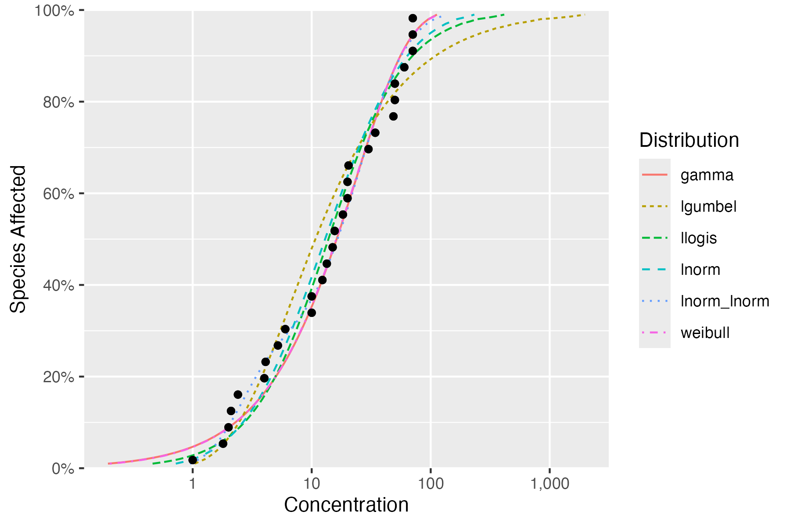
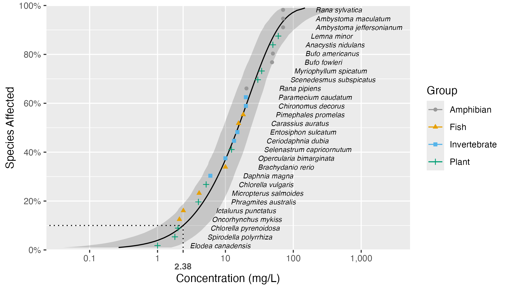

# Summary

Species sensitivity distributions (SSDs) are cumulative probability distributions that are used to estimate the percent of species that are affected by a given concentration of a chemical. 
The concentration that affects x% of the species is referred to as the Hazard Concentration (HCx) while the x% of species affected by a particular concentration is the Hazard Proportion (HPx). 
HC5 values, which protect 95% of species, are often used for the derivation of environmental quality criteria and ecological risk assessment for contaminated ecosystems [@posthuma_species_2001].

`ssdtools` is an R package [@r] to fit SSDs using Maximum Likelihood [@millar_maximum_2011] and to provide estimates of Hazard Concentration (HC) and Hazard Proportion (HP) values using single distributions, as well as a multiple distribution via model averaging. 
Since the initial publication by @thorley2018ssdtools for v0.0.3, the `sstools` R package has undergone two major updates.
The first update (v1) included the addition of four new distributions and a switch to `TMB` [@tmb] for model fitting.
The second major release (v2) includes critical updates to ensure that HCx and HPx estimates satisfy the *inversion principle* as well as bootstrap methods to obtain confidence intervals (CIs) with appropriate coverage.

# Statement of need

The SSD is a statistical approach that is used to estimate either the concentration of a chemical that is hazardous to no more than x% of species (HCx), or the proportion of species potentially affected by a given concentration (x) of a chemical (HPx). 
SSDs remain a practical tool for the determination of safe threshold concentrations for toxicants in fresh and marine waters, and are implemented in some form for risk assessment and water quality criteria derivation throughout multiple jurisdictions globally [@lepper2005manual; @Warne2018; @bcmecc2019; @USEPA2020].

The selection of a suitable probability model has been identified as one of the most important and difficult choices in the use of SSDs [@chapman_2007]. 
Since the original implementation, `ssdtools` has used model averaging to allow estimation of HCx and HPx values using multiple distributions, thereby avoiding the need for selection of a single distribution. 
The method, as applied in the SSD context is described in detail in [@fox_recent_2021], and provides a level of flexibility and parsimony that is difficult to achieve with a single distribution.

# Technical details

## Distributions

Ten distributions are currently available in `ssdtools`. 
The original version [@thorley2018ssdtools] provided the log-normal (lnorm), log-logistic (llogis), Gompertz (gompertz), log-Gumbel (lgumbel, also known as the inverse Weibull), gamma and weibull distributions. 
In the first major update, the two parameter inverse Pareto (invpareto), three parameter Burr Type III (burrIII3) and five parameter log-normal log-normal (lnorm_lnorm) and log-logistic log-logistic (llogis_llogis) mixture distributions were added.
Together with the inverse Weibull, the Burr Type III and inverse Pareto provide the underlying distributions of the SSD fitting software `Burrlioz` [@barry2012burrlioz] while the mixture distributions were added to accommodate bimodality [@fox_recent_2021]. 
Since v1, `ssdtools` has by default fitted the gamma, lgumbel, llogis, lnorm, lnorm_lnorm and weibull distributions.

## Model Fitting

In the first major update, `fitdistrplus` [@fitdistrplus] was replaced by `TMB` [@tmb] for fitting the available distributions via Maximum Likelihood. 
The move to `TMB` allowed more control over model specification, transparency regarding convergence criteria and better assessment of numerical instability issues. 

## Model Averaging

In both the original [@thorley2018ssdtools] and updated versions of `ssdtools` the Akaike Information Criterion (AIC), AIC corrected for small sample size (AICc) and Bayesian Information Criterion (BIC) can be calculated for each distribution [@burnham_model_2002].
Except in the case of censored data, `ssdtools` uses AICc based model weights for model averaging. 

The original implementation [@thorley2018ssdtools] used the weighted arithmetic mean for model averaging: $$\bar{X}=\sum\limits_{i=1}^{m}{{{w}_{i}}{{X}_{i}}}$$ 
where $w_i$ is the weight for the *i^th^* model, $0\le {w_i}\le 1$ and $\sum\limits_{i=1}^{m}{{w_i}=1}$. 

The weighted arithmetic mean is conventionally used for averaging model parameters or estimates [@burnham_model_2002]. 
However, in the case of HCx and HPx values, the conventional approach produces estimates that fail to satisfy the *inversion principle* [@fox_methodologies_2024]. 
Consequently, v2 of `ssdtools` treats the distribution set as an ensemble with a single proper *cumulative distribution function* (cdf) given by the expression: 
$$G\left( x \right) = \sum\limits_{i = 1}^m {{w_i}} {F_i}\left( x \right)$$
where ${F_i}\left(  \cdot  \right)$ is cdf for the the *i^th^* model and $w_i$ is the model weight as before.

HCx and HPx estimates are then obtained from the joint cdf as the solution to
$${x:G\left( x \right) = p}$$ 
or, equivalently
$$x:G\left( x \right) - p = 0$$ for the fraction affected $p$. 
Finding the solution to this last equation is referred to as *finding the root(s)* of the function $G\left( x \right)$. 

## Confidence Intervals

`ssdtools` generates confidence intervals for HCx and HPx values via bootstrapping.
By default all versions of `ssdtools` use parametric bootstrapping as it has better coverage than the equivalent non parametric approach used in other SSD modelling software, such as `Burrlioz` [see @fox_methodologies_2021].
The first two versions of `ssdtools` (v0 and v1) both calculated the model averaged CI from the weighted arithmetic mean of the CIs of the individual distributions (`ci = "weighted_arithmetic"`).
Unfortunately, this approach has recently been shown to have poor coverage [@fox_methodologies_2024] and is inconsistent with the *inversion principle*.

Consequently, v2 also offers a parametric bootstrap method that uses the joint cdf to generate data before refitting the original distribution set and solving for the newly estimated joint cdf [see details in @fox_methodologies_2024].
This "multi" method can be implemented with and without re-estimation of the model weights (`"multi_free"` vs `"multi_fixed"`).
However, although the "multi" method has good coverage it is computationally slow.
As a result, the default method (`ci = "weighted_samples"`) provided by the current update is a faster heuristic based on taking bootstrap samples from the individual distributions proportional to their weights [@fox_methodologies_2024].

## Plotting 

As well as to fitting SSDs and providing methods for estimating HCx and HPx values, `ssdtools` also extends the `ggplot2` R package [@ggplot2] by defining `ssdfit`, `xribbon` and `hcintersect` geometries to allow the user to produce custom SSD plots.

# Example of use

The following code fits the default distributions to the boron example data set from `ssddata` [@ssddata] and prints the goodness of fit table complete with information criteria:

```r
# install.packages("ssdtools")
library(ssdtools)
set.seed(42)
fits <- ssd_fit_dists(ssddata::ccme_boron)
ssd_gof(fits)
```

```r
# A tibble: 6 × 9
  dist           ad     ks    cvm   aic  aicc   bic delta weight
  <chr>       <dbl>  <dbl>  <dbl> <dbl> <dbl> <dbl> <dbl>  <dbl>
1 gamma       0.440 0.117  0.0554  238.  238.  240. 0.005  0.357
2 lgumbel     0.829 0.158  0.134   244.  245.  247. 6.56   0.013
3 llogis      0.487 0.0994 0.0595  241.  241.  244. 3.39   0.066
4 lnorm       0.507 0.107  0.0703  239.  240.  242. 1.40   0.177
5 lnorm_lnorm 0.320 0.116  0.0414  240.  243.  247. 4.98   0.03 
6 weibull     0.434 0.117  0.0542  238.  238.  240. 0      0.357
```

The model averaged HC5 estimate with 95% CIs can then be obtained using:

```r
ssd_hc(fits, ci = TRUE)
```

```r
# A tibble: 1 × 11
  dist    proportion   est    se   lcl   ucl    wt method     nboot pboot samples  
  <chr>        <dbl> <dbl> <dbl> <dbl> <dbl> <dbl> <chr>      <dbl> <dbl> <I<list>>
1 average       0.05  1.26 0.818 0.397  3.41     1 parametric  1000 0.999 <dbl [0]>
```

And all of the distributions plotted via:
```r
autoplot(fits)
```

{height="4in"}

The complete model averaged cdf with 95% CIs (with the model averaged HC5 indicated by a dotted line) can be plotted using:

```r
predictions <- ssdtools::predict(fits, ci = TRUE)
library(ggplot2)
ssd_plot(ssddata::ccme_boron, predictions,
         shape = "Group", color = "Group", label = "Species",
         xlab = "Concentration (mg/L)"
) +
  expand_limits(x = 3000) +
  scale_colour_ssd()
```

{height="4in"}

# Acknowledgements

We acknowledge contributions from Ali Azizishirazi, Angeline Tillmanns, Stephanie Hazlitt, Kathleen McTavish, Emilie Doussantousse, Heather Thompson and Andy Teucher.
Development of `ssdtools` was funded by the Ministry of Environment and Climate Change Strategy, British Columbia and the Department of Climate Change, Energy, the Environment and Water, Australia.

# References
