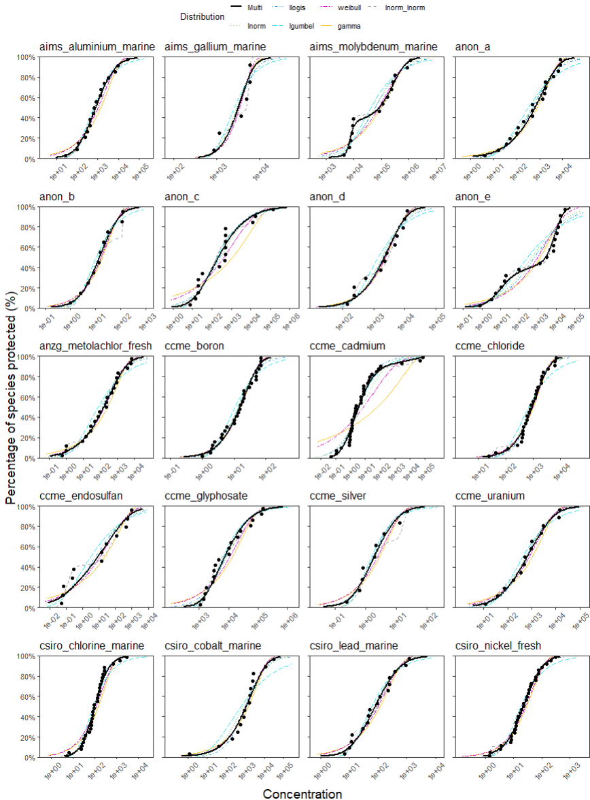

<style>
.box {
  height: auto;
  width: 65%;
  padding: 10px;
  border: 1.5px outset #5C5B5D;
  background-color: #E7E8EC;
  border-radius: 8px;
  text-align: left;
  margin: auto;
}
</style>

<script type="text/x-mathjax-config">MathJax.Hub.Config({  "HTML-CSS": { minScaleAdjust: 0.5, availableFonts: [] }  });
</script>


```{r, include = FALSE}
knitr::opts_chunk$set(
  collapse = TRUE,
  comment = "#>",
  fig.width = 6,
  fig.height = 4,
  echo = TRUE
)
```

## Small sample bias

The ssdtools package uses the method of Maximum Likelihood (ML) to estimate parameters for each distribution that is fit to the data. 
Statistical theory says that maximum likelihood estimators are asymptotically unbiased, but does not guarantee performance in small samples. 
A detailed account of the issue of small sample bias in estimates can be found in the following [pdf](https://github.com/bcgov/ssdtools/blob/master/vignettes/small-sample-bias.pdf).

## Investigations into setting minimum sample sizes for uni-modal and bi-modal distributions in ssdtools

Most jurisdictions require a minimum sample size for fitting a valid SSD. 
The current Australian and New Zealand minimum is 5, in order to fit the two-parameter log-normal distribution [@warne2018]. 
In ssdtools the default minimum sample size is 6 [@thorleysschwartz2018joss], which is consistent with the current methodology for British Columbia [@ccme]. 

Here we report on a series of simulation studies designed to inform a final decision on the default minimum sample size to adopt for both the uni-modal 2 parameter distributions, as well as the bi-modal 5 parameter distributions.

### Bias and CI coverage and interval width

#### Simulations based on ssddata

We used the example datasets in the [`ssddata`](https://github.com/open-AIMS/ssddata) package in R [@ssddata] to undertake a simulation study to examine bias, coverage and confidence interval (CI) widths using the recommended default set of six distributions (lognormal, log-Gumbel, log-logistic, gamma, Weibull, and the lognormal-log-normal mixture), with model averaged estimates obtained using the multi-method, and confidence intervals estimated using the recommended weighted sample bootstrap method (see @fox_methodologies_2024).
A total of 20 unique datasets were extracted from ssddata and used to define the parameters for the simulation study as follows:

  1.	Each dataset was extracted from `ssddata` and fit using the default distribution set as recommended in [@fox_methodologies_2022] and [@fox_methodologies_2024].
  2.	Of the six default distributions, the parameters for the distribution having the highest weight for each dataset was used to generate new random datasets of varying values of N, including (but not limited to): 5 (current ANZG minimum), 6 (current BC minimum), and 8 (current ANZG preferred).
  3.	For each randomly generated dataset, `ssdtools` was used to re-fit the data, and model averaged estimates were obtained using the multi-method, with upper and lower confidence limits (CLs) produced using the recommended weighted sample method (see [Confidence Intervals for Hazard Concentrations](https://bcgov.github.io/ssdtools/articles/confidence-intervals.html) vignette).

The individual ssdtools fits are shown below for each of the 20 simulation datasets from ssddata, for the six recommended default distributions, as well as the model averaged CDF (black line):

 \

This simulation process was repeated a minimum of 1,000 times for each dataset, and the results collated across all iterations. 
For each simulated dataset the true HCx values were obtained directly from the parameter estimates of from data generating distribution.
From these, relative bias was calculated as the scaled-difference between the estimated HCx values and the true HCx value, i.e  $$\frac{\widehat {HC}x-HCx}{HCx}$$ where $\widehat {HC}x$ is the estimate of the true value, $HCx$; coverage was calculated as the proportion of simulations where the true $HCx$ value fell within the lower and upper 95% confidence limits; and the scaled confidence interval width was calculated as $$\frac{UL-LL}{HCx}$$ where $UL$ and $LL$ are the upper and lower limits respectively.

Bias, confidence interval width and coverage as a function of sample size across ~1000 simulations of 20 datasets using the multi model averaging method and the weighted sample method for estimating confidence intervals via ssdtools are shown below:

 \

The simulation results showed significant gains in terms of reduced bias from N=5 to N=6, as well as in coverage, which improved substantially between N=5 and N=6. 
There is also a small additional gain in coverage at N=7, where the median of the simulations reaches the expected 95% but this is only the case for HC1.

#### Simulations based on EnviroTox

In addition to the analysis based on the 20 ssddata example datasets, we also ran an expanded simulation study based on the EnviroTox dataset analysed by Yanagihara et al. (2024). 
Combined with the ssddata examples, this includes a total of 353 example datasets to use as case studies. 
Using this larger dataset as a basis for simulations, we followed the same procedure as described above to examine relative bias, as well as changes in the AICc weights (see below) for various sample sizes. 
Estimates of coverage and confidence interval widths were not obtained for this larger dataset due to the computationally intensive bootstrap method of obtaining confidence intervals.

Bias of sample size across ~1000 simulations of 353 datasets using the multi model averaging method via ssdtools, for HC5, 10 and 20 (0.05, 0.1, and 0.2) are shown below:

 \

Note that simulation results are shown separately for those derived from each of the six distributions as the underlying source data generating distribution.

The bias results for this larger combined dataset did not show the same level of  improvement from N=5 to N=6 as that based on the smaller ssddata simulation. 
However, there as a gradual improvement in bias with increasing N. 
There is no strong evidence for preferring  N=6 over N=7 in the context of bias from either of the simulation studies. 
We note that the bias was highest at these small sample sizes for data generated using a gamma distribution, likely reflecting the extreme left-tailed nature of this distribution. 

### AICc based model weights

Aside from considerations of bias, coverage and confidence interval width, it is also prudent to examine how the weights of the different distributions changed with sample size, for data generated using the six different default distributions, to more fully investigate sample size issues associated with the use of the mixture distributions. 
This was examined using the simulation study across the larger combined ssddata and EnviroTox datasets (353 datasets) to ensure a wide range of potential representations of each of the six default distributions was considered.

Below is a plot of the mean AICc weights as a function of sample size (N) obtained for data simulated using the best fit distribution to 353 datasets. 
Results are shown separately for the six different source distributions, with the upper plot (A) showing the AICc weight of the source (data generating) distributions, when fit using the default set of six distributions using ssdtools; and the lower plot (B) showing the AICc weight of the lognormal-lognormal mixture distribution for each of the source (data generating) distributions.

 \

We found that the AICc weights for the five unimodal distributions were relatively similar (~0.2) for very low N. 
This is because for small N it is difficult to discern differences between the distributions in the candidate list.
The weights increase to above 0.5 as N increases (i.e. their converge to the true underlying generating distribution at high N, upper plot). 
For very low sample sizes (N=5, 6 or 7) the source (data-generating) distribution is not preferentially weighted by the AICc (upper plot, A).

For the lnorm_lnorm mixture, AICc weights can be >0.5 at relatively N (>8, lower plot, B).
We also looked specifically at the AICc weight of the lognormal-lognormal mixture as one of six distributions in the default candidate set, across simulation based on all six source generating distributions.
This was done to examine the potential for erroneously highly weighting the lognormal-lognormal mixture distribution by chance, when data are generated instead using one of the five unimodal distributions.
For all the unimodal source distributions the lognormal-lognormal mixture never has high AICc weight, even at very high sample sizes (N=256, lower plot, B).
The AICc weights are particularly low for the lnorm_lnorm mixture at low sample sizes for all the uni-modal source distributions (a desirable property) (lower plot, B). 

### Conclusions

Overall, the results suggest that (relative) bias as a function of N behaves as expected.
The N=6 recommendation appears to be well-supported as coverage is particularly low for N=5, but acceptable for N=6.
The lognormal-lognormal mixture AICc weights suggest that this distribution will only be preferred (i.e. have a high AICc weight) when (i) there is clear evidence of bimodality in the source data; and (ii) large N.

Based on these results, our recommendation is that only a single minimum sample size of N=6 be adopted (for both unimodal and bimodal), since our results suggest any gains in increasing this to 7 are minimal.

## The inverse Pareto and inverse Weibull as limiting distributions of the Burr Type-III distribution

### Burr III distribution

The probability density function, ${f_X}(x;b,c,k)$ and cumulative distribution function, ${F_X}(x;b,c,k)$ for the Burr III distribution (also known as the *Dagum* distribution) as used in `ssdtools` are

<div style="text-align: center; font-size: 1.2em; color: black; border: 1px solid black; padding: 10px; border-radius: 5px;">
  <b><u>Burr III Distribution</u></b>
  
  $$f_X(x; b, c, k) = \frac{b \, k \, c}{x^2} \frac{\left( \frac{b}{x} \right)^{c - 1}}{\left[ 1 + \left( \frac{b}{x} \right)^c \right]^{k + 1}}, \quad b, c, k, x > 0$$
  
  $$F_X(x; b, c, k) = \frac{1}{\left[ 1 + \left( \frac{b}{x} \right)^c \right]^k}, \quad b, c, k, x > 0$$

</div>

<br>

### Inverse Pareto distribution

Let $X \sim Burr(b,c,k)$ have the *pdf* given in the box above. 
It is well known that the distribution of $Y = \frac{1}{X}$ is the *inverse Burr* distribution (also known as the *SinghMaddala* distribution) for which 

\[
\begin{array}{*{20}{c}}
{{f_Y}(y;b,c,k) = \frac{{c{\kern 1pt} {\kern 1pt} k{{\left( {\frac{y}{b}} \right)}^c}}}{{y{\kern 1pt} {{\left[ {1 + {{\left( {\frac{y}{b}} \right)}^c}} \right]}^{k + 1}}}}}, & {b,c,k,y > 0}
\end{array}
\]

\[
\begin{array}{*{20}{c}}
{{F_Y}(y;b,c,k) = 1 - \frac{1}{{{{\left[ {1 + {{\left( {\frac{y}{b}} \right)}^c}} \right]}^k}}}}, & {b,c,k,y > 0}
\end{array}
\]

We now consider the limiting distribution when $c \to \infty$ and $k \to 0$ in such a way that the product $ck$ remains constant, i.e. $ck = \lambda$.

Now,
\[
\begin{array}{l}
\mathop {\mathop {\lim }\limits_{(c,k) \to (\infty ,0)} }\limits_{ck = \lambda } \left\{ {{F_Y}(y;b,c,k)} \right\} = 1 - \mathop {\mathop {\lim }\limits_{(c,k) \to (\infty ,0)} }\limits_{ck = \lambda } \frac{1}{{{{\left[ {1 + {{\left( {\frac{y}{b}} \right)}^c}} \right]}^k}}} \\
\\
\text{and} \\
\\
\mathop {\mathop {\lim }\limits_{(c,k) \to (\infty ,0)} }\limits_{ck = \lambda } {\left[ {1 + {{\left( {\frac{y}{b}} \right)}^c}} \right]^k} = \mathop {\mathop {\lim }\limits_{(c,k) \to (\infty ,0)} }\limits_{ck = \lambda } \left\{ {{{\left( {\frac{y}{b}} \right)}^{ck}}{{\left[ {1 + {{\left( {\frac{b}{y}} \right)}^c}} \right]}^k}} \right\} \\
\\
\text{and} \\
\\
\mathop {\mathop {\lim }\limits_{(c,k) \to (\infty ,0)} }\limits_{ck = \lambda } \left\{ {{{\left( {\frac{y}{b}} \right)}^{ck}}{{\left[ {1 + {{\left( {\frac{b}{y}} \right)}^c}} \right]}^k}} \right\} = \mathop {\mathop {\lim }\limits_{(c,k) \to (\infty ,0)} }\limits_{ck = \lambda } \left\{ {{{\left( {\frac{y}{b}} \right)}^{ck}}} \right\}\mathop {\mathop {\lim }\limits_{(c,k) \to (\infty ,0)} }\limits_{ck = \lambda } \left\{ {{{\left[ {1 + {{\left( {\frac{b}{y}} \right)}^c}} \right]}^k}} \right\} \\
= \mathop {\mathop {\lim }\limits_{(c,k) \to (\infty ,0)} }\limits_{ck = \lambda } \left\{ {{{\left( {\frac{y}{b}} \right)}^{ck}}} \right\}\; \cdot \,1 \\
= {\left( {\frac{y}{b}} \right)^\lambda }
\end{array}
\]

Therefore,
\[
\begin{array}{*{20}{c}}
{\mathop {\mathop {\lim }\limits_{(c,k) \to (\infty ,0)} }\limits_{ck = \lambda } \left\{ {{F_Y}(y;b,c,k)} \right\} = 1 - {{\left( {\frac{b}{y}} \right)}^\lambda }} & {y \ge b}
\end{array}
\]

which we recognise as the (American) Pareto distribution. So, if the limiting distribution of $Y = \frac{1}{X}$ is a Pareto distribution, then the limiting distribution of $X = \frac{1}{Y}$ is the (American) *inverse Pareto* distribution

\[
\begin{array}{l}
{f_X}\left( {x;\alpha ,\beta } \right) = \lambda {b^\lambda }{x^{\lambda  - 1}};{\rm{  }}0 \le x \le {\textstyle{1 \over b}};{\rm{  }}\lambda {\rm{,}}b > 0 \\
{F_X}\left( {x;\alpha ,\beta } \right) = {\left( {xb} \right)^\lambda };{\rm{  }}0 \le x \le {\textstyle{1 \over b}};{\rm{  }}\lambda {\rm{,}}b > 0
\end{array}
\]

For completeness, the MLEs of this distribution have closed-form expressions and are given by

\[
\begin{array}{l}
\hat \lambda  = \left[ \ln \left( \frac{{g_X}}{{\hat b}} \right) \right]^{-1} \\
\hat b = \frac{1}{{\max \{ X_i \}}}
\end{array}
\]

and $\rm{g_X}$ is the *geometric mean* of the data.

### Inverse Weibull distribution

Let \( X \sim \text{Burr}(b,c,k) \) have the *pdf* given in the box above. We make the transformation \( Y = \frac{b k^{\frac{1}{c}} \theta}{X} \), where \( \theta \) is a parameter (constant). The distribution of \( Y \) is also a Burr distribution and has *cdf* 

\[
G_Y(y) = 1 - \frac{1}{\left[ 1 + \left( \frac{y}{k^{\frac{1}{c}} \theta} \right)^c \right]^k}.
\]

We are interested in the limiting behavior of this Burr distribution as \( k \to \infty \).

Now,

\[
\lim_{k \to \infty} G_Y(y) = 1 - \lim_{k \to \infty} \left[ 1 + \left( \frac{y}{k^{\frac{1}{c}} \theta} \right)^c \right]^{-k}.
\]

\[
= 1 - \lim_{k \to \infty} \left[ 1 + \frac{\left( \frac{y}{\theta} \right)^c}{k} \right]^{-k}.
\]

\[
= 1 - \exp \left[ -\left( \frac{y}{\theta} \right)^c \right],
\]

\[
\left\{ \text{using the fact that } \lim_{n \to \infty} \left( 1 + \frac{z}{n} \right)^{-n} = e^{-z} \right\}.
\]

We recognize the last expression as the *cdf* of a Weibull distribution with parameters \( c \) and \( \theta \).

## References

<div id="refs"></div>

```{r, results = "asis", echo = FALSE}
cat(ssdtools::ssd_licensing_md())
```
