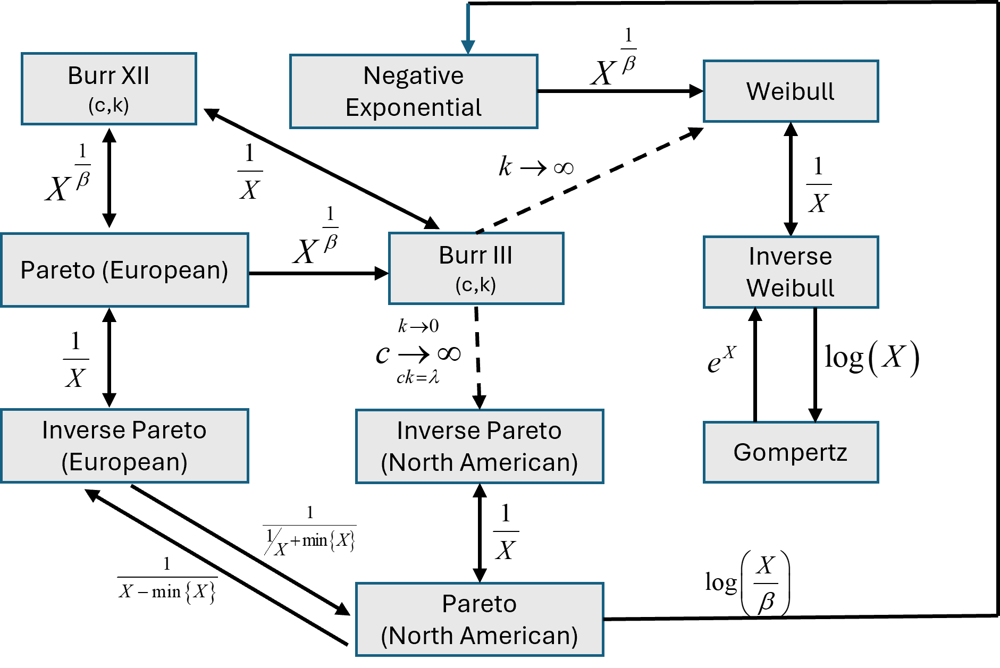

```{r, include = FALSE}
knitr::opts_chunk$set(
  collapse = TRUE,
  comment = "#>",
  fig.width = 6,
  fig.height = 4
)
```

<style>

.box {
  height: auto;
  width: 75%;
  padding: 10px;
  border: 1.5px outset #5C5B5D;
  background-color: #E7E8EC;
  border-radius: 8px;
  text-align: left;
  margin: auto;
}

</style>

<script type="text/x-mathjax-config">MathJax.Hub.Config({  "HTML-CSS": { minScaleAdjust: 0.5, availableFonts: [] }  });
</script>

## Distributions for SSD modelling

Many authors have noted that there is no guiding theory in ecotoxicology to justify a particular distributional form for the SSD other than that its domain be restricted to the positive real line [@newman_2000; @Zajdlik_2005; @fox_2016]. 
Distributions selected to use in model averaging of SSDs must be bounded by zero given that effect concentrations cannot be negative. 
They must also be continuous, and generally unbounded on the right.
Furthermore, the selected distributions within the candidate model set should provide a variety of shapes to capture the diversity of shapes in empirical species sensitivity distributions.

To date `r length(ssdtools::ssd_dists())` distributions have been implemented in `ssdtools`, although only `r length(ssdtools::ssd_dists_bcanz())` appear in the default set. 
Here we provide a detailed account of all `r length(ssdtools::ssd_dists())` of the distributions available in `ssdtools`, and guidance on their use.

### Original `ssdtools` distributions

The log-normal, log-logistic and Gamma distributions have been widely used in SSD modelling, and were part of the original distribution set for early releases of `ssdtools` as developed by @thorley_ssdtools_2018. 
They were adopted as the default set of three distributions in early updates of `ssdtools` and the associated ShinyApp [@dalgarno_shinyssdtools_2021].
All three distributions show good convergence properties and are retained as part of the default model set in version 2.0 of `ssdtools`.

In addition to the log-normal, log-logistic and Gamma distributions, the original version of `ssdtools` as developed by [Thorley and Schwarz (2018)](https://joss.theoj.org/papers/10.21105/joss.01082.pdf) also included three additional distributions in the candidate model set, including the log-gumbel, Gompertz and Weibull distributions. 
Of these, the log-Gumbel (otherwise known as the inverse Weibull, see below) shows relatively good convergence [see Figure 32, @fox_methodologies_2022], and is also one of the limiting distributions of the Burr Type 3 distribution implemented in `ssdtools`, and has been retained in the default model set.
The Gompertz and Weibull distributions, however can exhibit unstable behaviour, sometimes showing poor convergence, and therefore been excluded from the default set [see Figure 32, @fox_methodologies_2022]

### Burr III distribution

A history of Burrlioz and the primary distributions it used were recently summmarized by @fox_recent_2021.

> In 2000, Australia and New Zealand (Australian and New Zealand Environment and Conservation Council/Agriculture and Resource Management Council of Australia and New Zealand 2000) adopted an SSD‐based method for deriving WQBs, following a critical review of multiple WQB derivation methods (Warne 1998). 
A distinct feature of the method was the use of a 3‐parameter Burr distribution to model the empirical SSD, which was implemented in the Burrlioz software tool (Campbell et al. 2000). 
This represented a generalization of the methods previously employed by Aldenberg and Slob (1993) because the log–logistic distribution
was shown to be a specific case of the Burr family (Tadikamalla 1980).
Recent revision of the derivation method recognized that using the 3‐parameter Burr distributions for small sample sizes (<8 species) created additional uncertainty by estimating more parameters than could be justified, essentially overfitting the data (Batley et al. 2018).
Consequently, the method, and the updated software (Burrlioz Ver 2.0), now uses a 2‐parameter log–logistic distribution for these small
data sets, whereas the Burr type III distribution is used for data sets of 8 species or more (Batley et al. 2018; Australian and
New Zealand Guidelines 2018).

[@fox_recent_2021]

The probability density function, ${f_X}(x;b,c,k)$ and cumulative distribution function, ${F_X}(x;b,c,k)$ for the Burr III distribution are:

<div style="text-align: center; font-size: 1.2em; color: black; border: 1px solid black; padding: 10px; border-radius: 5px;">
  <b><u>Burr III Distribution</u></b>
  
  $$f_X(x;b,c,k) = \frac{{b\,k\,c}}{{x^2}} \frac{{\left( \frac{b}{x} \right)}^{c - 1}}{{\left[ 1 + \left( \frac{b}{x} \right)^c \right]}^{k + 1}}; \quad b, c, k, x > 0$$
  
  <br>
  
  $$F_X(x;b,c,k) = \frac{1}{{\left[ 1 + \left( \frac{b}{x} \right)^c \right]}^k}; \quad b, c, k, x > 0$$

</div>

<br>

```{r echo=FALSE,fig.align='center',fig.width=9,fig.height=5, fig.cap="Sample Burr probability density (A) and cumulative probability (B) functions."}
par(mfrow = c(1, 2))

f <- function(x, b, c, k) {
  z1 <- (b / x)^(c - 1)
  z2 <- (b / x)^c
  y <- (b * c * k / x^2) * z1 / (1 + z2)^(k + 1)
  return(y)
}

conc <- seq(0, 10, by = 0.005)
plot(conc, f(conc, 1, 3, 5), type = "l", ylab = "Probability density", xlab = "Concentration", col = "#FF5733")
lines(conc, f(conc, 1, 1, 2), col = "#F2A61C")
lines(conc, f(conc, 1, 2, 2), col = "#1CADF2")
lines(conc, f(conc, 1, 2, 5), col = "#1F1CF2")
legend("topleft", "(A)", bty = "n")

F <- function(x, b, c, k) {
  z2 <- (b / x)^c
  y <- 1 / (1 + z2)^k
  return(y)
}
conc <- seq(0, 10, by = 0.005)
plot(conc, F(conc, 1, 3, 5), type = "l", ylab = "Cumulative probability", xlab = "Concentration", col = "#FF5733")
lines(conc, F(conc, 1, 1, 2), col = "#F2A61C")
lines(conc, F(conc, 1, 2, 2), col = "#1CADF2")
lines(conc, F(conc, 1, 2, 5), col = "#1F1CF2")
legend("topleft", "(B)", bty = "n")
```

While the Burr type III distribution was adopted as the default distribution in Burrlioz, it is well known (e.g., Tadikamalla (1980)) that the Burr III distribution is related to several other theoretical distributions, some of which only exist as limiting cases of the Burr III, i.e., as one or more of the Burr III parameters approaches either zero or infinity. 
The Burrlioz software incorporates logic that aims to identify situations where parameter estimates are tending towards either very large or very small values. 
In such cases, fitting a Burr III distribution is abandoned and one of the limiting
distributions is fitted instead. 

Specifically: 

 - As c tends to infinity the Burr III distribution tends to the inverse (North American) Pareto distribution (see [technical details](https://bcgov.github.io/ssdtools/articles/E_additional-technical-details.html))
 
 - As k tends to infinity the Burr III distribution tends to the inverse Weibull (log-Gumbel) distribution (see [technical details](https://bcgov.github.io/ssdtools/articles/E_additional-technical-details.html))

In practical terms, if the Burr III distribution is fitted and k is estimated to be greater than 100, the estimation procedure is carried out again using an inverse Weibull distribution.
Similarly, if c is greater than 80 an (American) Pareto distribution is fitted. This is necessary to
ensure numerical stability.

Since the Burr type III, inverse Pareto and inverse Weibull (log Gumbel) distributions are used by the Burrlioz software, these have been implemented in `ssdtools`.
However, we have found there are stability issues with both the Burr type III, as well as the inverse Pareto distributions, which currently precludes their inclusion in the default model set (see @fox_methodologies_2022, and below for more details).

### Bimodal distributions

The use of statistical mixture-models was promoted by Fox as a convenient and more realistic way of modelling bimodal toxicity data [@fisher2019].
Although parameter heavy, statistical mixture models provide a better conceptual match to the inherent underlying data generating process since they directly model bimodality as a mixture of 2 underlying univariate distributions that represent, for example, different modes of action [@fox_recent_2021]. 
It has been postulated that a mixture-model would only be selected in a model-averaging context when the fit afforded by the mixture is demonstrably better than the fit afforded by any single distribution.
This is a consequence of the high penalty in AICc associated with the increased number of parameters (p in Equation 7 of [@fox_recent_2021]) and will be most pronounced for relatively small sample sizes.

The TMB version of `ssdtools` now includes the option of fitting two mixture distributions, individually or as part of a model average set.
These can be fitted using `ssdtools` by supplying the strings "llogis_llogis" and/or "lnorm_lnorm" to the *dists* argument in the *ssd_fit_dists* call.

The underlying code for these mixtures has three components: the likelihood function required for TMB; exported R functions to allow the usual methods for a distribution to be called (p, q and r); and a set of supporting R functions (see @fox_methodologies_2022  Appendix D for more details). 
Both mixtures have five parameters - two parameters for each of the component distributions and a mixing parameter (pmix) that defines the weighting of the two distributions in the ‘mixture.’

```{r echo=FALSE,fig.align='center',fig.width=9,fig.height=5, fig.cap="Sample lognormal lognormal mixture probability density (A) and cumulative probability (B) functions."}
par(mfrow = c(1, 2))

f <- function(x, m1, s1, m2, s2, p) {
  y <- p * dlnorm(x, m1, s1) + (1 - p) * dlnorm(x, m2, s2)
  return(y)
}

conc <- seq(0, 5, by = 0.0025)
m1 <- 1
s1 <- .2
m2 <- 1.8
s2 <- 1.5
p <- 0.25
plot(conc, f(conc, m1, s1, m2, s2, p), type = "l", ylab = "Probability density", xlab = "Concentration", col = "#FF5733", ylim = c(0, 1))
lines(conc, f(conc, 0.09, 0.5, 1, 0.08, 0.9), col = "#F2A61C")
lines(conc, f(conc, 0.5, 0.5, 1, 0.08, 0.9), col = "#1CADF2")
lines(conc, f(conc, 0.7, 1.5, 0.5, 0.1, .7), col = "#1F1CF2")
legend("topleft", "(A)", bty = "n")

F <- function(x, m1, s1, m2, s2, p) {
  y <- p * plnorm(x, m1, s1) + (1 - p) * plnorm(x, m2, s2)
  return(y)
}

conc <- seq(0, 10, by = 0.0025)
m1 <- 1
s1 <- .2
m2 <- 1.8
s2 <- 1.5
p <- 0.25
plot(conc, F(conc, m1, s1, m2, s2, p), type = "l", ylab = "Cumulative probability", xlab = "Concentration", col = "#FF5733", ylim = c(0, 1))
lines(conc, F(conc, 0.09, 0.5, 1, 0.08, 0.9), col = "#F2A61C")
lines(conc, F(conc, 0.5, 0.5, 1, 0.08, 0.9), col = "#1CADF2")
lines(conc, F(conc, 0.7, 1.5, 0.5, 0.1, .7), col = "#1F1CF2")
legend("topleft", "(B)", bty = "n")
```

<br>As can be see from the plot above, the mixture distributions provide a highly flexible means of modelling *bimodality* in an emprical SSD. 
This happens, for example, when the toxicity data for some toxicant include both animal and plant species, or there are different modes of action operating.
Unfortunately, this increased flexibility comes with a high penalty in the model-averaging process. 
The combination of small sample sizes and a high parameter count (typically 5 or more) means that mixture distributions will be down-weighted - even when they do a good job at describing the data. 
For this reason, when attempting to model bimodal data, we suggest looking at the fit using the default set of distributions and then examining the fit with just one of either the log-normal mixture or the log-logistic mixture. 
Keep in mind that this should only be done if the sample size is not pathologically small. 
As a guide, Prof. David Fox recommends as an *absolute minimum* $n \ge 3k + 1$ but preferably $n \ge 5k + 1$ where $k$ is the number of model parameters.

## Default Distributions

While there is a variety of distributions available in `ssdtools`, the inclusion of all of them for estimating a model-averaged SSD is not recommended.

By default, `ssdtools` uses the (corrected) Akaike Information Criterion for small sample size (AICc) as a measure of relative quality of fit for different distributions and as the basis for calculating the model-averaged weights. 
However, the choice of distributions used to fit a model-averaged SSD can have a profound effect on the estimated *HCx* values.

Deciding on a final default set of distributions to adopt using the model averaging approach is non-trivial, and we acknowledge that there is probably no definitive ‘solution’ to this issue. 
However, the default set should be underpinned by a guiding principle of parsimony, i.e., the set should be as large as is necessary to cover a wide variety of distributional shapes and contingencies but no bigger.
Further, the default set should result in model-averaged estimates of *HCx* values that: 1) minimise bias; 2) have actual coverages of confidence intervals that are close to the nominal level of confidence; 3) estimated *HCx* and confidence intervals of *HCx* are robust to small changes in the data; and 4) represent a positively continuous distribution that has both right and left tails.

The `ssdtools` development team has undertaken extensive simulation studies, as well as some detailed technical examinations of the various candidate distributions to examine issues of bias, coverage and numerical stability.
A detailed account of our findings can be found in our report [@fox_methodologies_2022] and are not repeated in detail here, although some of the issues associated with individual distributions are outlined below.

### Currently recommended default distributions

The default list of candidate distributions in `ssdtools` is comprised of the following: log-normal; log-logistic; gamma; inverse Weibull (log-Gumbel); Weibull; mixture of two log-normal distributions

The default distributions are plotted below with a mean of 2 and standard deviation of 2 on the (natural) log concentration scale or around 7.4 on the concentration scale.

```{r, message=FALSE, echo=FALSE, fig.width=7,fig.height=5, fig.cap="Currently recommended default distributions."}
library(ssdtools)
library(ggplot2)

# theme_set(theme_bw())

set.seed(7)

ssd_plot_cdf(ssd_match_moments(meanlog = 2, sdlog = 2)) +
  scale_color_ssd()
```


## Distributions currently implemented in `ssdtools`

#### Burr Type III distribution

The Burr Type 3 is a flexible three parameter distribution can be fitted using `ssdtools` by supplying the string  `burrIII3`  to the `dists` argument in the `ssd_fit_dists` call.

<div style="text-align: center; font-size: 1.2em; color: black; border: 1px solid black; padding: 10px; border-radius: 5px;">
  <b><u>Burr III distribution</u></b>

<br><br><i>See above for details</i>

</div>

<br>

The Burr family of distributions has been central to the derivation of guideline values in Australia and New Zealand for over 20 yr [@fox_recent_2021]. While offering a high degree of flexibility, experience with these distributions during that time has repeatedly highlighted numerical stability and convergence issues when parameters are estimated using maximum likelihood [@fox_recent_2021]. 
This is thought to be due to the high degree of collinearity between parameter estimates and/or relatively flat likelihood profiles [@fox_recent_2021], and is one of the motivations behind the logic coded into Burrlioz to revert to either of the two limiting distributions.
Burr Type 3 distribution is not currently one of the recommended distributionsin the default model set. 
This is because of 1) the convergence issues associated with the Burr Type 3 distribution, 2) the fact that reverting to a limiting two parameter distribution does not fit easily within a model averaging framework, and 3) that one of the two limiting distributions (the inverse Pareto, see below) also has estimation and convergence issues.

#### Log-normal

The [log-normal](https://en.wikipedia.org/wiki/Log-normal_distribution) distribution is a commonly used distribution in the natural sciences - particularly as a probability model to describe right (positive)-skewed phenomena such as *concentration* data.

A random variable, $X$ is lognormally distributed if the *logarithm* of $X$ is normally distributed. The *pdf* of $X$ is given by 

<div style="text-align: center; font-size: 1.2em; color: black; border: 1px solid black; padding: 10px; border-radius: 5px;">
  <b><u>Log-normal Distribution</u></b>
  
  $${f_X}\left( x; \mu, \sigma \right) = \frac{1}{\sqrt{2\pi}\ \sigma x}\exp \left[ - \frac{\left( {\ln x - \mu } \right)^2}{2\sigma^2} \right] ;\ x,\sigma  > 0;\ - \infty  < \mu  < \infty$$
</div>

<br>

The log-normal distribution was selected as the starting distribution given the data are for effect concentrations. 
The log-normal distribution can be fitted using `ssdtools` supplying the string `lnorm` to the `dists` argument in the `ssd_fit_dists` call.

```{r echo=FALSE,fig.align='center',fig.width=9,fig.height=5,fig.cap="Sample lognormal probability density (A) and cumulative probability (B) functions."}
par(mfrow = c(1, 2))

conc <- seq(0, 10, by = 0.005)
m1 <- 1
s1 <- .2
m2 <- 1.8
s2 <- 1.5
p <- 0.25
plot(conc, dlnorm(conc, m1, s1), type = "l", ylab = "Probability density", xlab = "Concentration", col = "#FF5733", ylim = c(0, 1))
lines(conc, dlnorm(conc, 0.4, 2), col = "#F2A61C")
lines(conc, dlnorm(conc, m1 * 2, s1), col = "#1CADF2")
lines(conc, dlnorm(conc, 0.9, 1.5), col = "#1F1CF2")
legend("topleft", "(A)", bty = "n")

conc <- seq(0, 10, by = 0.005)
m1 <- 1
s1 <- .2
m2 <- 1.8
s2 <- 1.5
p <- 0.25
plot(conc, plnorm(conc, m1, s1), type = "l", ylab = "Cumulative probability", xlab = "Concentration", col = "#FF5733", ylim = c(0, 1))
lines(conc, plnorm(conc, 0.4, 2), col = "#F2A61C")
lines(conc, plnorm(conc, m1 * 2, s1), col = "#1CADF2")
lines(conc, plnorm(conc, 0.9, 1.5), col = "#1F1CF2")
legend("topleft", "(B)", bty = "n")
```

#### Log-logistic distribution

Like the *lognormal* distribution, the [log-logistic](https://en.wikipedia.org/wiki/Log-logistic_distribution) is similarly defined, that is: if $X$ has a log-logistic distribution, then $Y = \ln (X)$ has a *logistic* distribution.

<div style="text-align: center; font-size: 1.2em; color: black; border: 1px solid black; padding: 10px; border-radius: 5px;">
  <b><u>Log-logistic Distribution</u></b>
  
  $${f_Y}\left( {y;\alpha ,\beta } \right) = \frac{\left( \frac{\beta}{\alpha} \right) \left( \frac{y}{\alpha} \right)^{\beta - 1}}{\left[ 1 + \left( \frac{y}{\alpha} \right)^\beta \right]^2}; \quad y, \alpha, \beta > 0$$
  
  $${F_Y}\left( {y;\alpha ,\beta } \right) = \frac{\left( \frac{y}{\alpha} \right)^\beta}{1 + \left( \frac{y}{\alpha} \right)^\beta}; \quad y, \alpha, \beta > 0$$

</div>

<br>

letting $\mu  = \ln \left( \alpha  \right)$ and $s = \frac{1}{\beta }$ we have:

<div style="text-align: center; font-size: 1.2em; color: black; border: 1px solid black; padding: 10px; border-radius: 5px;">
  <b><u>Logistic Distribution</u></b>
  
  $${f_X}\left( {x;\mu ,s} \right) = \frac{e^{-x}}{\left( 1 + e^{-x} \right)^2}; \quad x, s > 0, \; -\infty < \mu < \infty$$
  
  $${F_X}\left( {x;\mu ,s} \right) = \frac{1}{1 + e^{-\frac{x - \mu}{s}}}; \quad x, s > 0, \; -\infty < \mu < \infty$$

</div>

<br>

The log-logistic distribution is often used as a candidate SSD primarily because of its analytic tractability [@aldenberg_confidence_1993].
We included it because it has wider tails than the log-normal and because it is a specific case of the more general Burr family of distributions [@shao_estimation_2000, @burr_cumulative_1942].
The log-logistic distribution can be fitted using `ssdtools` by supplying the string `lnorm` to the `dists` argument in the `ssd_fit_dists` call.

```{r echo=FALSE,fig.align='center',fig.width=9,fig.height=5,fig.cap="Sample Log logistic probability density (A) and cumulative probability (B)  functions."}
par(mfrow = c(1, 2))

f <- function(x, a, b) {
  z1 <- (x / a)^(b - 1)
  z2 <- (x / a)^b
  y <- (b / a) * z1 / (1 + z2)^2
  return(y)
}

conc <- seq(0, 10, by = 0.005)
plot(conc, f(conc, 3.2, 3.5), type = "l", ylab = "Probability density", xlab = "Concentration", col = "#FF5733", ylim = c(0, 1.1))
lines(conc, f(conc, 1.5, 1.5), col = "#F2A61C")
lines(conc, f(conc, 1, 1), col = "#1CADF2")
lines(conc, f(conc, 1, 4), col = "#1F1CF2")
legend("topleft", "(A)", bty = "n")

F <- function(x, a, b) {
  z2 <- (x / a)^(-b)
  y <- 1 / (1 + z2)
  return(y)
}
conc <- seq(0, 10, by = 0.005)
plot(conc, F(conc, 3.2, 3.5), type = "l", ylab = "Cumulative probability", xlab = "Concentration", col = "#FF5733", ylim = c(0, 1.1))
lines(conc, F(conc, 1.5, 1.5), col = "#F2A61C")
lines(conc, F(conc, 1, 1), col = "#1CADF2")
lines(conc, F(conc, 1, 4), col = "#1F1CF2")
legend("topleft", "(B)", bty = "n")
```

#### Gamma distribution
The two-parameter  [gamma](https://en.wikipedia.org/wiki/Gamma_distribution) distribution has the following *pdf* and *cdf*.

<div style="text-align: center; font-size: 1.2em; color: black; border: 1px solid black; padding: 10px; border-radius: 5px;">
  <b><u>Gamma Distribution</u></b>
  
  $${f_X}\left( {x;b,c} \right) = \frac{x^{c - 1} e^{-\frac{x}{b}}}{b^c \, \Gamma(c)}, \quad 0 \leq x < \infty,b,c > 0$$
  
  $${F_X}\left( {x;b,c} \right) = \frac{1}{\Gamma(c)} \, \gamma\left(c, \frac{x}{b}\right), \quad 0 \leq x < \infty,b,c > 0$$

</div>

<br>

where $\Gamma \left(  \cdot  \right)$ is the *gamma* function (in `R` this is simply `gamma(x)`) and $\gamma \left(  \cdot  \right)$ is the (lower) *incomplete gamma* function \[\gamma \left( {x,a} \right) = \int\limits_0^x {{t^{a - 1}}} \,{e^{ - t}}\,dt\] (this can be computed using the  `gammainc` function from the `pracma` package in `R`).

For use in modeling species sensitivity data, the gamma distribution has two key features that provide additional flexibility relative to the log-normal distribution: 1) it is asymmetrical on the logarithmic scale; and 2) it has wider tails.

The gamma distribution can be fitted using `ssdtools` by supplying the string  "gamma" to the *dists* argument in the *ssd_fit_dists* call.  

```{r echo=FALSE,fig.align='center',fig.width=9,fig.height=5,fig.cap="Sample gamma probability density (A) and cumulative probability (B) functions."}
par(mfrow = c(1, 2))

conc <- seq(0, 10, by = 0.005)
plot(conc, dgamma(conc, 5, 5), type = "l", ylab = "Probability density", xlab = "Concentration", col = "#FF5733", ylim = c(0, 1.1))
lines(conc, dgamma(conc, 4, 1), col = "#F2A61C")
lines(conc, dgamma(conc, 0.9, 1), col = "#1CADF2")
lines(conc, dgamma(conc, 2, 1.), col = "#1F1CF2")
legend("topleft", "(A)", bty = "n")

conc <- seq(0, 10, by = 0.005)
plot(conc, pgamma(conc, 5, 5), type = "l", ylab = "Cumulative probability", xlab = "Concentration", col = "#FF5733", ylim = c(0, 1.1))
lines(conc, pgamma(conc, 4, 1), col = "#F2A61C")
lines(conc, pgamma(conc, 0.9, 1), col = "#1CADF2")
lines(conc, pgamma(conc, 2, 1.), col = "#1F1CF2")
legend("topleft", "(B)", bty = "n")
```

#### Log-gumbel (inverse Weibull) distribution

The log-gumbel distribution is a two-parameter distribution commonly used to model extreme values.
The log-gumbel distribution can be fitted using `ssdtools` by supplying the string `lgumbel` to the `dists` argument in the `ssd_fit_dists` call. 
The two-parameter log-gumbel distribution has the following *pdf* and *cdf*:

<div style="text-align: center; font-size: 1.2em; color: black; border: 1px solid black; padding: 10px; border-radius: 5px;">
  <b><u>Log-Gumbel Distribution</u></b>
  
  $${f_X}\left( {x;\alpha ,\beta } \right) = \frac{\beta \, e^{-(\alpha x)^{-\beta}}}{\alpha^\beta \, x^{\beta + 1}}, \quad x, \alpha, \beta > 0$$
  
  $${F_X}\left( {x;\alpha ,\beta } \right) = e^{-(\alpha x)^{-\beta}}, \quad x, \alpha, \beta > 0$$
  
</div>

<br>

```{r echo=FALSE,fig.align='center',fig.width=9,fig.height=5,fig.cap="Sample Log-Gumbel probability density (A) and cumulative probability (B) functions."}
par(mfrow = c(1, 2))

f <- function(x, a, b) {
  y <- b * exp(-(a * x)^(-b)) / (a^b * x^(b + 1))
  return(y)
}

conc <- seq(0, 10, by = 0.005)
plot(conc, f(conc, 0.2, 5), type = "l", ylab = "Probability density", xlab = "Concentration", col = "#FF5733", ylim = c(0, 1.1))
lines(conc, f(conc, 0.5, 1.5), col = "#F2A61C")
lines(conc, f(conc, 1, 2), col = "#1CADF2")
lines(conc, f(conc, 10, .5), col = "#1F1CF2")
legend("topleft", "(A)", bty = "n")

F <- function(x, a, b) {
  y <- exp(-(a * x)^(-b))
  return(y)
}

conc <- seq(0, 10, by = 0.005)
plot(conc, F(conc, 0.2, 5), type = "l", ylab = "Cumulative probability", xlab = "Concentration", col = "#FF5733", ylim = c(0, 1.1))
lines(conc, F(conc, 0.5, 1.5), col = "#F2A61C")
lines(conc, F(conc, 1, 2), col = "#1CADF2")
lines(conc, F(conc, 10, .5), col = "#1F1CF2")
legend("topleft", "(B)", bty = "n")
```


#### Gompertz distribution

The Gompertz distribution is a flexible distribution that exhibits both positive and negative skewness.
The Gompertz distribution can be fitted using `ssdtools` by supplying the string `gompertz` to the `dists` argument in the `ssd_fit_dists` call. 
We consider two parameterisations of the Gompertz distribution.
The first, as given in [Wikipedia](https://en.wikipedia.org/wiki/Gompertz_distribution) and also used in `ssdtools` [Gompertz] has the following *pdf* and *cdf*:

<div style="text-align: center; font-size: 1.2em; color: black; border: 1px solid black; padding: 10px; border-radius: 5px;">
  <b><u>Gompertz Distribution: Parameterisation I</u></b>
  
  $${f_X}\left( {x;\eta ,b} \right) = b \eta \exp\left(\eta + bx - \eta e^{bx}\right), \quad 0 \leq x < \infty, \eta, b > 0$$
  
  $${F_X}\left( {x;\eta ,b} \right) = 1 - \exp\left[ -\eta \left(e^{bx} - 1\right) \right], \quad 0 \leq x < \infty, \eta, b > 0$$

</div>

<br>

The second parameterisation in which the *product* $b\eta$ in the formulae above is replaced by the parameter $a$ giving:

<div style="text-align: center; font-size: 1.2em; color: black; border: 1px solid black; padding: 10px; border-radius: 5px;">
  <b><u>Gompertz Distribution: Parameterisation II</u></b>
  
  $${f_X}(x;a,b) = \frac{a}{b} e^{\frac{x}{b}} \exp\left[ -a\left(e^{\frac{x}{b}} - 1\right) \right], \quad 0 \leq x < \infty, a, b > 0$$
  
  $${F_X}(x;a,b) = 1 - \exp\left[ -a\left(e^{\frac{x}{b}} - 1\right) \right], \quad 0 \leq x < \infty, a, b > 0$$
  
</div>

<br>

```{r echo=FALSE,fig.align='center',fig.width=9,fig.height=5,fig.cap="Sample Gompertz probability density (A) and cumulative probability (B) functions."}
par(mfrow = c(1, 2))

f <- function(x, n, b) {
  y <- n * b * exp(n + b * x - n * exp(b * x))
  return(y)
}

conc <- seq(0, 10, by = 0.005)
plot(conc, f(conc, 0.089, 1.25), type = "l", ylab = "Probability density", xlab = "Concentration", col = "#FF5733", ylim = c(0, 2))
lines(conc, f(conc, 0.001, 3.5), col = "#F2A61C")
lines(conc, f(conc, 0.0005, 1.1), col = "#1CADF2")
lines(conc, f(conc, 0.01, 5), col = "#1F1CF2")
legend("topleft", "(A)", bty = "n")

F <- function(x, n, b) {
  y <- 1 - exp(-n * exp(b * x - 1))
  return(y)
}

conc <- seq(0, 10, by = 0.005)
plot(conc, F(conc, 0.089, 1.25), type = "l", ylab = "Cumulative probability", xlab = "Concentration", col = "#FF5733", ylim = c(0, 1))
lines(conc, F(conc, 0.001, 3.5), col = "#F2A61C")
lines(conc, F(conc, 0.0005, 1.1), col = "#1CADF2")
lines(conc, F(conc, 0.01, 5), col = "#1F1CF2")
legend("topleft", "(B)", bty = "n")
```

The Gompertz distribution is available in `ssdtools`, however parameter estimation can be somewhat unstable [@fox_methodologies_2022], and for this reason it is not currently included in the default set.

#### Weibull distribution

The inclusion of the Weibull distribution and inverse Pareto distribution (see next) in `ssdtools` was primarily necessitated by the need to maintain consistency with the calculations undertaken in `Burrlioz`. 
As mentioned earlier, both the Weibull and inverse Pareto distributions arise as *limiting distributions* when the Burr parameters $c$ and $k$ tend to either zero and/or infinity in specific ways.

The two-parameter [Weibull](https://en.wikipedia.org/wiki/Weibull_distribution) distribution has the following *pdf* and *cdf*:

<div style="text-align: center; font-size: 1.2em; color: black; border: 1px solid black; padding: 10px; border-radius: 5px;">
  <b><u>Weibull Distribution</u></b>
  
  $${f_X}(x;c,\theta) = \frac{c}{\theta} \left( \frac{x}{\theta} \right)^{c - 1} e^{-\left( \frac{x}{\theta} \right)^c}, \quad 0 \leq x < \infty, c, \theta > 0$$
  
  $${F_X}(x;c,\theta) = 1 - e^{-\left( \frac{x}{\theta} \right)^c}, \quad 0 \leq x < \infty, c, \theta > 0$$

</div>

<br>

The Weibull distribution can be fitted in `ssdtools` by supplying the string  `weibull` to the `dists` argument in the `ssd_fit_dists` call.  

```{r echo=FALSE,fig.align='center',fig.width=9,fig.height=5,fig.cap="Sample Weibull probability density (A) and cumulative probability (B) functions."}
par(mfrow = c(1, 2))

conc <- seq(0, 10, by = 0.005)
plot(conc, dweibull(conc, 4.321, 4.949), type = "l", ylab = "Probability density", xlab = "Concentration", col = "#FF5733", ylim = c(0, 1))
lines(conc, dweibull(conc, 0.838, 0.911), col = "#F2A61C")
lines(conc, dweibull(conc, 1, 1.546), col = "#1CADF2")
lines(conc, dweibull(conc, 17.267, 7.219), col = "#1F1CF2")
legend("topleft", "(A)", bty = "n")

conc <- seq(0, 10, by = 0.005)
plot(conc, pweibull(conc, 4.321, 4.949), type = "l", ylab = "Cumulative probability", xlab = "Concentration", col = "#FF5733", ylim = c(0, 1))
lines(conc, pweibull(conc, 0.838, 0.911), col = "#F2A61C")
lines(conc, pweibull(conc, 1, 1.546), col = "#1CADF2")
lines(conc, pweibull(conc, 17.267, 7.219), col = "#1F1CF2")
legend("topleft", "(B)", bty = "n")
```


#### Inverse Pareto distribution

The inverse Pareto distribution can be fitted using `ssdtools` by supplying the string `invpareto`  to the `dists` argument in the `ssd_fit_dists` call. 

While the inverse Pareto distribution is implemented in the `Burrlioz 2.0` software, it is important to understand that it is done so only as one of the limiting Burr distributions (see [technical details](https://bcgov.github.io/ssdtools/articles/E_additional-technical-details.html)).
The inverse Pareto is not offered as a stand-alone option in the `Burrlioz 2.0` software. We have spent considerable time and effort exploring the properties of the inverse Pareto distribution, including deriving bias correction equations and alternative methods for deriving confidence intervals [@fox_methodologies_2022]. 
This work has substantial value for improving the current `Burrlioz 2.0` method, and our bias corrections should be adopted when deriving *HCx* estimates from the inverse Pareto where parameters have been estimated using maximum likelihood.

As is the case with the `Burrlioz 2.0` software, we have decided not to include the inverse Pareto distribution in the default candidate set in `ssdtools` although it is offered ass a user-selectable distribution to use in the model-fitting process.

As with many statistical distributions, different 'variants' exist. These 'variants' are not so much different distributions as they are simple re-parameterisations. 
For example, many distributions have a *scale* parameter, $\beta$ and some authors and texts will use $\beta$ while others use $\frac{1}{\beta }$. 
An example of this re-parameterisation was given above for the Gompertz distribution. 
While the choice of mathematical representation may be purely preferential, it is sometimes done for mathematical convenience. 
For example, Parameterisation I of the Gompertz distribution above was obtained by letting $a = b\eta$  in Parameterisation II. 
This re-expression involving parameters $b$ and $\eta$ would be particularly useful when trying to fit a distribution for which one of $\left\{ {b,\,\eta } \right\}$ was very small and the other was very large.

It has already been noted that the particular parameterisation of the (Inverse)Pareto distribution used in both `Burrlioz 2.0` and `ssdtools` was **not** a matter of preference, but rather was dictated by mathematical considerations which demonstrated convergence of the Burr distribution to one specific version of the (Inverse)Pareto distribution. 
While the mathematics provides an elegant solution to an otherwise problematic situation, this version of the (Inverse)Pareto distribution is not particularly use as a stand-alone distribution for fitting an SSD (other than as a special, limiting case of the Burr distribution).

The two versions of the (Inverse)Pareto distribution are known as the *European* and *North American* versions. Their *pdfs* and *cdfs* are given below.

<hr>

<div style="text-align: left; font-size: 1.2em; color: black; border: 1px solid black; padding: 10px; border-radius: 5px;">
  &nbsp;&nbsp;&nbsp;&nbsp;&nbsp;&nbsp;&nbsp;&nbsp;&nbsp;&nbsp;&nbsp;&nbsp;&nbsp;&nbsp;&nbsp;&nbsp;&nbsp;&nbsp;&nbsp;&nbsp;<b><u>(Inverse) Pareto Distribution - North American Version</u><br><br> Pareto Distribution</b>
  
  $${f_X}\left( {x;\alpha ,\beta } \right) = \alpha \beta^\alpha x^{-(\alpha + 1)}, \quad x > \beta, \; \alpha, \beta > 0$$
  
  $${F_X}\left( {x;\alpha ,\beta } \right) = 1 - \left( \frac{\beta}{x} \right)^\alpha, \quad x > \beta, \; \alpha, \beta > 0$$
  
  Now, if \( X \) has the Pareto distribution above, then <br> \[ Y = \frac{1}{X} \] <br> has an <i>inverse Pareto distribution.</i><br><br><b>Inverse Pareto Distribution</b>
  
  $${g_Y}\left( {y;\alpha ,\beta } \right) = \alpha \beta^\alpha y^{\alpha - 1}, \quad y \le \frac{1}{\beta}, \; \alpha, \beta > 0$$
  
  $${G_Y}\left( {y;\alpha ,\beta } \right) = \left( \beta y \right)^\alpha, \quad 0 < y \le \frac{1}{\beta}, \; \alpha, \beta > 0$$

</div>

<br>

Importantly, we see that the *North American* versions of these distributions are <b><u>bounded</u></b> with the Pareto distribution bounded **below** by $\beta$ and the inverse Pareto distribution bounded *above* by $\frac{1}{\beta }$.<br>As an aside, the *mle* of $\beta$ in the Pareto distribution is \[\hat \beta  = \min \left\{ {{X_1}, \ldots ,{X_n}} \right\}\] and the *mle* of $\frac{1}{\beta }$ in the inverse Pareto is \[\begin{array}{*{20}{l}}
{\tilde \beta  = \max \left\{ {{Y_1}, \ldots ,{Y_n}} \right\}}\\
{\quad  = \max \left\{ {\frac{1}{{{X_1}}}, \ldots ,\frac{1}{{{X_n}}}} \right\} = \frac{1}{{\min \left\{ {{X_1}, \ldots ,{X_n}} \right\}}}}\\
{\quad  = \frac{1}{{\hat \beta }}}
\end{array}\].

and the *mle* of $\alpha$ is: \[\hat \alpha  = {\left[ {\ln \left( {\frac{g}{{\hat \beta }}} \right)} \right]^{ - 1}}\] where $g$ is the *geometric mean*: \[g = {\left[ {\prod\limits_{i = 1}^n {{X_i}} } \right]^{\frac{1}{n}}}\]

Thus, it doesn't matter whether you're fitting a Pareto or inverse Pareto distribution to your data - the parameter estimates are the <u>same</u>.

Because it is *bounded*, the North American version of the (Inverse)Pareto distribution is not useful as a stand-alone SSD - more so for the *inverse Pareto* distribution since it is bounded from *above*.

```{r echo=FALSE,fig.align='center',fig.width=9,fig.height=5,fig.cap="Sample North American Pareto probability density (A) and cumulative probability (B) functions."}
par(mfrow = c(1, 2))

conc <- seq(0, 10, by = 0.005)
plot(conc, extraDistr::dpareto(conc, 3, 2), type = "l", ylab = "Probability density", xlab = "Concentration", col = "#FF5733", ylim = c(0, 1.5))
lines(conc, extraDistr::dpareto(conc, 0.838, 0.911), col = "#F2A61C")
lines(conc, extraDistr::dpareto(conc, 4, 4), col = "#1CADF2")
lines(conc, extraDistr::dpareto(conc, 10, 7), col = "#1F1CF2")
legend("topleft", "(A)", bty = "n")

conc <- seq(0, 10, by = 0.005)
plot(conc, extraDistr::ppareto(conc, 3, 2), type = "l", ylab = "Cumulative probability", xlab = "Concentration", col = "#FF5733", ylim = c(0, 1))
lines(conc, extraDistr::ppareto(conc, 0.838, 0.911), col = "#F2A61C")
lines(conc, extraDistr::ppareto(conc, 4, 4), col = "#1CADF2")
lines(conc, extraDistr::ppareto(conc, 10, 7), col = "#1F1CF2")
legend("topleft", "(B)", bty = "n")

conc <- seq(0, 10, by = 0.005)
plot(conc, extraDistr::ppareto(conc, 3, 2), type = "l", ylab = "Cumulative probability", xlab = "Concentration", col = "#FF5733", ylim = c(0, 1))
lines(conc, extraDistr::ppareto(conc, 0.838, 0.911), col = "#F2A61C")
lines(conc, extraDistr::ppareto(conc, 4, 4), col = "#1CADF2")
lines(conc, extraDistr::ppareto(conc, 10, 7), col = "#1F1CF2")
```

```{r echo=FALSE,fig.align='center',fig.width=9,fig.height=5,fig.cap="Sample Sample North American inverse Pareto probability density (A) and cumulative probability (B) functions."}
par(mfrow = c(1, 2))

f <- function(x, a, b) {
  y <- a * (b^a) * x^(a - 1)
  return(y)
}

conc <- seq(0, 10, by = 0.001)
plot(conc, f(conc, 5, 0.1), type = "l", ylab = "Probability density", xlab = "Concentration", col = "#FF5733", ylim = c(0, 0.5))
lines(conc, f(conc, 3, 0.1), col = "#F2A61C")
lines(conc, f(conc, 0.5, 0.1), col = "#1CADF2")
lines(conc, f(conc, 0.1, 0.1), col = "#1F1CF2")
legend("topleft", "(A)", bty = "n")

F <- function(x, a, b) {
  y <- (b * x)^a
  return(y)
}

conc <- seq(0, 10, by = 0.001)
plot(conc, F(conc, 5, 0.1), type = "l", ylab = "Probability density", xlab = "Concentration", col = "#FF5733", ylim = c(0, 1))
lines(conc, F(conc, 3, 0.1), col = "#F2A61C")
lines(conc, F(conc, 0.5, 0.1), col = "#1CADF2")
lines(conc, F(conc, 0.1, 0.1), col = "#1F1CF2")
legend("topleft", "(B)", bty = "n")
```

We see from the *pdf* plots that the alternative, *European* version of the inverse Pareto distribution is a more realistic candidate.

<hr>

<div style="text-align: left; font-size: 1.2em; color: black; border: 1px solid black; padding: 10px; border-radius: 5px;">
  &nbsp;&nbsp;&nbsp;&nbsp;&nbsp;&nbsp;&nbsp;&nbsp;&nbsp;&nbsp;&nbsp;&nbsp;&nbsp;&nbsp;&nbsp;&nbsp;&nbsp;&nbsp;&nbsp;&nbsp;<b><u>(Inverse) Pareto Distribution - European Version</u><br><br> Pareto Distribution</b>
  
  $${f_X}\left( {x;\alpha ,\beta } \right) = \frac{\alpha \beta x^{\alpha - 1}}{\left( x + \beta \right)^{\alpha + 1}}, \quad x, \alpha, \beta > 0$$
  
  $${F_X}\left( {x;\alpha ,\beta } \right) = 1 - \left( \frac{\beta}{x + \beta} \right)^\alpha, \quad x, \alpha, \beta > 0$$
  
  Now, if \( X \) has the Pareto distribution above, then <br> \[ Y = \frac{1}{X} \] <br> has an <i>inverse Pareto distribution.</i><br><br><b>Inverse Pareto Distribution</b>
  
  $${g_Y}\left( {y;\alpha ,\beta } \right) = \frac{\alpha \beta^\alpha y^{\alpha - 1}}{\left( 1 + \beta y \right)^{\alpha + 1}}, \quad y, \alpha, \beta > 0$$
  
  $${G_Y}\left( {y;\alpha ,\beta } \right) = \left( \frac{\beta y}{1 + \beta y} \right)^\alpha, \quad y, \alpha, \beta > 0$$

</div>

<br>

We note in passing that *both* versions of these Pareto and inverse Pareto distrbutions are available in `R`. 
For example, the `R`package `extraDistr` has North American versions, while the `actuar` package has European versions.

```{r echo=FALSE,fig.align='center',fig.width=9,fig.height=5,fig.cap="Sample European Pareto probability density (A) and cumulative probability (B) functions."}
par(mfrow = c(1, 2))

conc <- seq(0, 10, by = 0.005)
plot(conc, actuar::dpareto(conc, 1, 1), type = "l", ylab = "Probability density", xlab = "Concentration", col = "#FF5733", ylim = c(0, 1))
lines(conc, actuar::dpareto(conc, 2, 3), col = "#F2A61C")
lines(conc, actuar::dpareto(conc, 0.5, 1), col = "#1CADF2")
lines(conc, actuar::dpareto(conc, 10.5, 6.5), col = "#1F1CF2")
legend("topleft", "(A)", bty = "n")

conc <- seq(0, 10, by = 0.005)
plot(conc, actuar::ppareto(conc, 1, 1), type = "l", ylab = "Cumulative probability", xlab = "Concentration", col = "#FF5733", ylim = c(0, 1))
lines(conc, actuar::ppareto(conc, 2, 3), col = "#F2A61C")
lines(conc, actuar::ppareto(conc, 0.5, 1), col = "#1CADF2")
lines(conc, actuar::ppareto(conc, 10.5, 6.5), col = "#1F1CF2")
legend("topleft", "(B)", bty = "n")
```

```{r echo=FALSE,fig.align='center',fig.width=9,fig.height=5,fig.cap="Sample European inverse Pareto probability density (A) and cumulative probability (B)  functions."}
par(mfrow = c(1, 2))

conc <- seq(0, 10, by = 0.001)
plot(conc, actuar::dinvpareto(conc, 1, 1), type = "l", ylab = "Probability density", xlab = "Concentration", col = "#FF5733", ylim = c(0, 0.8))
lines(conc, actuar::dinvpareto(conc, 1, 3), col = "#F2A61C")
lines(conc, actuar::dinvpareto(conc, 10, 0.1), col = "#1CADF2")
lines(conc, actuar::dinvpareto(conc, 2.045, 0.98), col = "#1F1CF2")
legend("topleft", "(A)", bty = "n")

conc <- seq(0, 10, by = 0.001)
plot(conc, actuar::pinvpareto(conc, 1, 1), type = "l", ylab = "Probability density", xlab = "Concentration", col = "#FF5733", ylim = c(0, 1))
lines(conc, actuar::pinvpareto(conc, 1, 3), col = "#F2A61C")
lines(conc, actuar::pinvpareto(conc, 10, 0.1), col = "#1CADF2")
lines(conc, actuar::pinvpareto(conc, 2.045, 0.98), col = "#1F1CF2")
```

#### Inverse Weibull distribution (see log-Gumbel, above)

The inverse Weibull is mathematically equivalent to the log-Gumbel distribution described above. 
While which is also a limiting distribution of the Burr Type 3, this distribution does not show the same instability issues, and is unbounded to the right. 
It therefore represents a valid SSD distribution and is included in the default model set as a distribution in its own right.

The inverse Weibull (log-Gumbel) distribution can be fitted in `ssdtools` by supplying the string  `lgumbel` to the `dists` argument in the `ssd_fit_dists` call.  

## Relationships among distributions in `ssdtools`

##### NOTES
1. In the diagram below, $X$ denotes the random variable in the box at the *beginning* of the arrow and the expression beside the arrow indicates the mathematical transformation of $X$ such that the resultant *transformed* data has the distribution identified in the box at the *end* of the arrow. 

2. *Reciprocal* transformations ($\frac{1}{X}$) are **bi-directional** ($\leftrightarrow$).

3. Although the *negative exponential* distribution is **not** explicitly included in `ssdtools`, it is a special case of the *gamma* distribution with $c=1$. It is included in this figure as it is related to other distributions that *are* included in `ssdtools`.

4. The *European* versions of the Pareto and inverse Pareto distributions are **unbounded**; the *North American* versions are **bounded**.

<hr>

{width=100%}

## References

<div id="refs"></div>

```{r, results = "asis", echo = FALSE}
cat(ssdtools::ssd_licensing_md())
```
