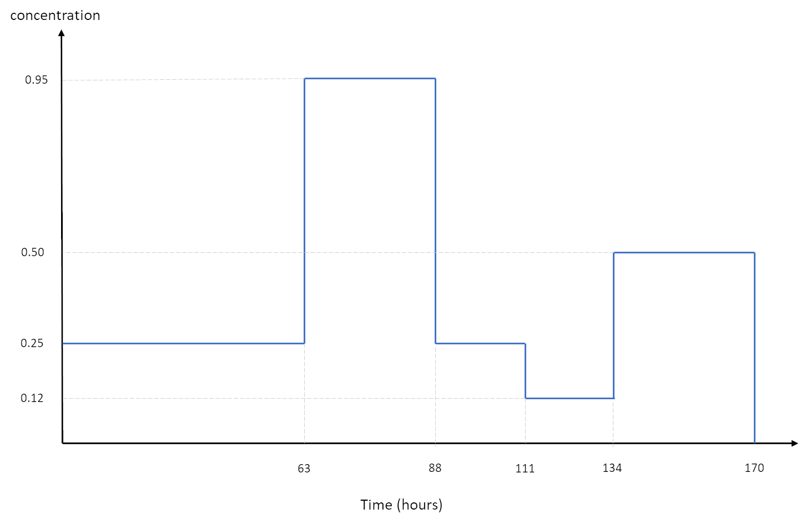
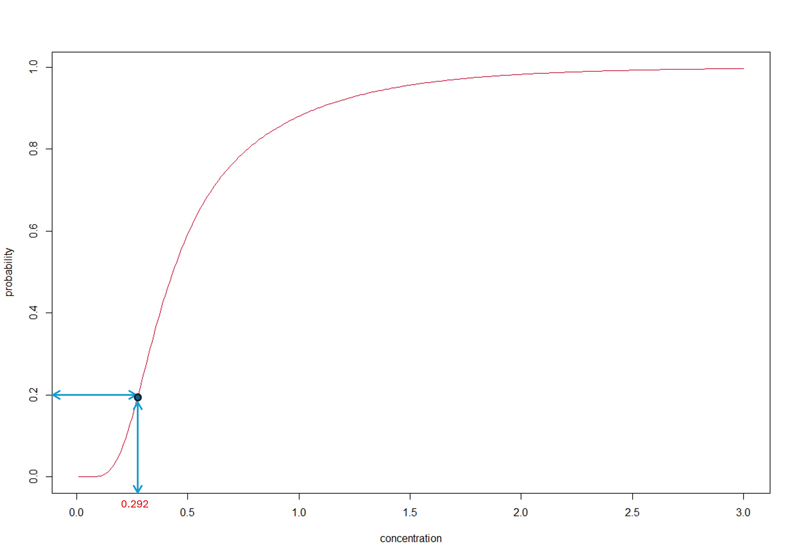
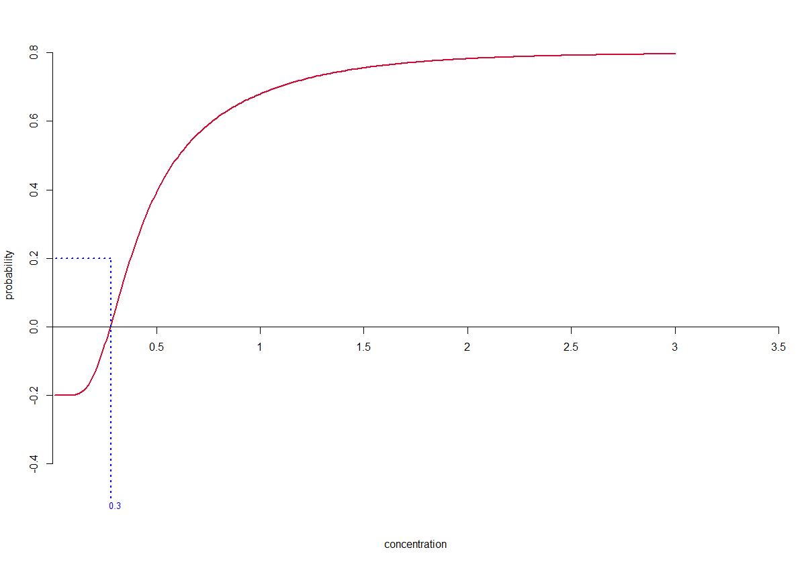

```{css, echo=FALSE}
pre {
  max-height: 300px;
  overflow-y: auto;
}

pre[class] {
  max-height: 200px;
}
```

```{css, echo=FALSE}
.scroll-200 {
  max-height: 200px;
  overflow-y: auto;
  background-color: inherit;
}
```


```{r, include = FALSE}
library(tinytex)
knitr::opts_chunk$set(
  collapse = TRUE,
  comment = "#>",
  fig.height = 4,
  fig.width = 6
)
```

<style>

.box {
  height: auto;
  width: 65%;
  padding: 10px;
  border: 1.5px outset #5C5B5D;
  background-color: #E7E8EC;
  border-radius: 8px;
  text-align: left;
  margin: auto;
}

</style>

<script type="text/x-mathjax-config">MathJax.Hub.Config({  "HTML-CSS": { minScaleAdjust: 0.5, availableFonts: [] }  });
</script>

```{r include=FALSE}
# this just loads the package and suppresses the load package message
library(ssdtools)
require(ggplot2)
require(patchwork)
```

## Background
*"Many authors have noted that there is no guiding theory in ecotoxicology to justify any particular distributional form for the SSD other than that its domain be restricted to the positive real line
[@newman_2000], [@Zajdlik_2005], [@chapman_2007], [@fox_2016]. Indeed, [@chapman_2007] described the identification of a suitable probability model as one of the most
important and difficult choices in the use of SSDs. Compounding this lack of clarity about the functional
form of the SSD is the omnipresent, and equally vexatious issue of small sample size, meaning that
any plausible candidate model is unlikely to be rejected [@fox_recent_2021]. The ssdtools R package
uses a model averaging procedure to avoid the need to a-priori select a candidate distribution and
instead uses a measure of ‘fit’ for each model to compute weights to be applied to an initial set of
candidate distributions. The method, as applied in the SSD context is described in detail in [@fox_recent_2021], and potentially provides a level of flexibility and parsimony that is difficult to achieve with a
single SSD distribution".* &nbsp;&nbsp;&nbsp; &nbsp;&nbsp;&nbsp; [@fox_methodologies_2021]

## Preliminaries
Before we jump into model averaging and in particular, SSD Model Averaging, let's backup a little and consider why we average and the advantages and disadvantages of averaging.<br>
<h4>The pros and cons of averaging</h4>
We're all familiar with the process of averaging. Indeed, *averages* are pervasive in everyday life - we talk of average income; mean sea level; average global temperature; average height, weight, age etc. etc. So what's the obsession with *averaging*? It's simple really - it's what statisticians call <u>data reduction</u> which is just a fancy name to describe the process of summarising a lot of *raw data* using a small number of (hopefully) representative <u>summary statistics</u> such as the mean and the standard deviation.  Clearly, it's a lot easier to work with just a single mean than all the individual data values. That's the upside. The downside is that the process of data reduction decimates your original data - you lose information in the process. Nevertheless, the benefits tend to outweigh this information loss. Indeed, much of 'conventional' statistical theory and practice is focused on the mean. Examples include T-tests, ANOVA, regression, and clustering. 
When we talk of an 'average' we are usually referring to the simple, *arithmetic mean*:\[\bar{X}=\frac{1}{n}\sum\limits_{i=1}^{n}{{{X}_{i}}}\] although we recognize there are other types of mean including the geometric mean, the harmonic mean and the weighted mean. The last of these is particularly pertinent to model averaging. 

### Weighted Averages

For the simple arithmetic mean, all of the individual values receive the same weighting - they each contribute $\frac{1}{n}$ to the summation. While this is appropriate in many cases, it's not useful when the components contribute to varying degrees. An example familiar to ecotoxicologists is that of a *time-varying* concentration as shown in the figure below.<br>


{width=90% align="center"}

 From the figure we see there are 5 concentrations going from left to to right: $\left\{ 0.25,0.95,0.25,0.12,0.5 \right\}$. If we were to take the simple arithmetic mean of these concentrations we get $\bar{X}=0.414$. But this ignores the different *durations* of these 5 concentrations. Of the 170 hours, 63 were at concentration 0.25, 25 at concentration 0.95, 23 at concentration 0.25, 23 at concentration 0.12, and 36 at concentration 0.50. So if we were to *weight* these concentrations by time have:<br>\[{{{\bar{X}}}_{TW}}=\frac{\left( 63\cdot 0.25+25\cdot 0.95+23\cdot 0.25+23\cdot 0.12+36\cdot 0.50 \right)}{\left( 63+25+23+23+36 \right)}=\frac{56.01}{170}=0.33\]<br>So, our formula for a *weighted average* is:\[\bar{X}=\sum\limits_{i=1}^{n}{{{w}_{i}}{{X}_{i}}}\] with $0\le {{w}_{i}}\le 1$ and $\sum\limits_{i=1}^{n}{{{w}_{i}}=1}$.<br>Note, the simple arithmetic mean is just a special case of the weighted mean with $\sum\limits_{i=1}^{n}{{{w}_{i}}=\frac{1}{n}}$ ; $\forall i=1,\ldots ,n$

## Model Averaging
The *weighted average* acknowledges that the elements in the computation are <u>not</u> of equal 'importance'. In the example above, this importance was based on the *proportion of time* that the concentration was at a particular level. Bayesians are well-versed in this concept - the elicitation of *prior distributions* for model parameters provides a mechanism for weighting the degree to which the analysis is informed by existing knowledge versus using a purely data-driven approach. Model averaging is usually used in the context of estimating model parameters or quantities derived from a fitted model - for example an EC50 derived from a C-R model. Let's motivate the discussion using the following small dataset of toxicity estimates for some chemical.


```{r echo=FALSE,warning=FALSE, message=FALSE,class.output="scroll-100"}
samp<-c(1.73,0.57,0.33,0.28,0.3,0.29,2.15,0.8,0.76,0.54,0.42,0.83,0.21,0.18,0.59)
 print(samp)
# knitr::kable(samp,caption="Some toxicity data (concentrations)")
```

Now, suppose we have only two possibilities for fitting an SSD - both lognormal distributions. Model 1 is the LN(-1.067,0.414) distribution while Model 2 is the LN(-0.387,0.617) distribution. A plot of the empirical *cdf* and Models 1 and 2 is shown below.

```{r echo=FALSE,fig.cap="Emprirical cdf (black); Model 1(green); and Model 2 (blue)", fig.width=7,fig.height=4.5}
samp<-c(1.73,0.57,0.33,0.28,0.3,0.29,2.15,0.8,0.76,0.54,0.42,0.83,0.21,0.18,0.59)
samp<-sort(samp)
plot(ecdf(samp),main="Empirical and fitted SSDs",xlab="Concentration",ylab="Probability")
xx<-seq(0.01,3,by=0.01)
lines(xx,plnorm(xx,meanlog=mean(log(samp[1:10])),sd=sd(log(samp[1:10]))),col= "#77d408" )
lines(xx,plnorm(xx,meanlog=mean(log(samp[5:15])),sd=sd(log(samp[5:15]))),col="#08afd4")
#lines(xx,(0.4419*plnorm(xx,meanlog=mean(log(samp[5:15])),sd=sd(log(samp[5:15])))+
#          0.5581*plnorm(xx,meanlog=mean(log(samp[1:10])),sd=sd(log(samp[1:10]))))  ,col="#d40830")


```

<br>We see that Model 1 fits well in the lower, left region and poorly in the upper region, while the reverse is true for Model 2. So using *either* Model 1 **or** Model 2 is going to result in a poor fit overall. However, the obvious thing to do is to **combine** both models. We could just try using 50% of Model 1 and 50% of Model 2, but that may be sub-optimal. It turns out that the best fit is obtained by using 44% of Model 1 and 56% of Model 2. Redrawing the plot and adding the *weighted average* of Models 1 and 2 is shown below.

```{r echo=FALSE,fig.cap="Empirical cdf (black); Model 1(green); Model 2 (blue); and averaged Model (red)",fig.width=7,fig.height=4.5}
samp<-c(1.73,0.57,0.33,0.28,0.3,0.29,2.15,0.8,0.76,0.54,0.42,0.83,0.21,0.18,0.59)
samp<-sort(samp)
plot(ecdf(samp),main="Empirical and fitted SSDs",xlab="Concentration",ylab="Probability")
xx<-seq(0.01,3,by=0.01)
lines(xx,plnorm(xx,meanlog=mean(log(samp[1:10])),sd=sd(log(samp[1:10]))),col= "#77d408" )
lines(xx,plnorm(xx,meanlog=mean(log(samp[5:15])),sd=sd(log(samp[5:15]))),col="#08afd4")
lines(xx,(0.4419*plnorm(xx,meanlog=mean(log(samp[5:15])),sd=sd(log(samp[5:15])))+
          0.5581*plnorm(xx,meanlog=mean(log(samp[1:10])),sd=sd(log(samp[1:10]))))  ,col="#d40830")


```

<br>Clearly the strategy has worked - we now have an excellent fitting SSD.What about estimation of an *HC20*?
 It's a simple matter to work out the *individual* *HC20* values for Models 1&2 using the appropriate `qlnorm()` function in `R`. Thus we have:

```{r, echo=TRUE}
# Model 1 HC20
cat("Model 1 HC20 =",qlnorm(0.2,-1.067,0.414))

# Model 2 HC20
cat("Model 2 HC20 =",qlnorm(0.2,-0.387,0.617))
```
What about the averaged distribution? An intuitively appealing approach would be to apply the same weights to the individual *HC20* values as was applied to the respective models. That is `0.44*0.2428209 + 0.56*0.4040243 = 0.33`.

So our model-averaged *HC20* estimate is 0.33. As a check, we can determine the *fraction affected* at concentration = 0.33 - it should of course be 20%. Let's take a look at the plot.

```{r echo=FALSE,fig.width=7,fig.height=5}
samp<-c(1.73,0.57,0.33,0.28,0.3,0.29,2.15,0.8,0.76,0.54,0.42,0.83,0.21,0.18,0.59)
samp<-sort(samp)
xx<-seq(0.01,3,by=0.01)


plot(xx,(0.4419*plnorm(xx,meanlog=mean(log(samp[5:15])),sd=sd(log(samp[5:15])))+
          0.5581*plnorm(xx,meanlog=mean(log(samp[1:10])),sd=sd(log(samp[1:10]))))  ,
          col="#d40830",type="l",xlab="Concentration",ylab="Probability")
segments(0.33,-1,0.33,0.292,col="blue",lty=21)
segments(-1,0.292,0.33,0.292,col="blue",lty=21)
mtext("0.3",side=2,at=0.3,cex=0.8,col="blue")
mtext("0.33",side=1,at=0.33,cex=0.8,col="blue")
```

Something's wrong - the fraction affected at concentration 0.33 is 30% - **not the required 20%**. This issue is taken up in the next section

## Model Averaged SSDs
As we've just seen, applying the model weights to component *HCx* values and summing does **not** produce the correct result. The reason for this can be explained mathematically as follows (*if your not interested in the mathematical explanation - skip ahead to the next section*).
<h4>The fallacy of weighting individual *HCx* values</h4>
The correct expression for a model-averaged SSD is: $$G\left( x \right) = \sum\limits_{i = 1}^k {{w_i}} {F_i}\left( x \right)$$
where ${F_i}\left(  \cdot  \right)$ is the *i^th^* component SSD (i.e. *cdf*) and *w~i~* is the weight assigned to ${F_i}\left(  \cdot  \right)$. <br>Notice that the function $G\left( x \right)$ is a proper *cumulative distribution function* (*cdf*) which means for a given quantile, *x*, $G\left( x \right)$ returns the *cumulative probability*: $$P\left[ {X \leqslant x} \right]$$

<br>Now, the *incorrect* approach takes a weighted sum of the component *inverse cdf's*, that is:

$$H\left( p \right) = \sum\limits_{i = 1}^k {{w_i}} {F_i}^{ - 1}\left( p \right)$$
where ${F_i}^{ - 1}\left(  \cdot  \right)$ is the *i^th^* *inverse cdf*.  Notice that ${G_i}\left(  \cdot  \right)$ is a function of a *quantile* and returns a **probability** while ${H_i}\left(  \cdot  \right)$ is a function of a *probability* and returns an **quantile**.<p>Now, the <u>correct</u> method of determining the *HCx* is to work with the proper model-averaged *cdf* $G\left( x \right)$. This means finding the **inverse** function ${G^{ - 1}}\left( p \right)$. We'll address how we do this in a moment.</p>
The reason why $H\left( p \right)$ does **not** return the correct result is because of <u>the implicit assumption that the inverse of $G\left( x \right)$ is equivalent to $H\left( p \right)$.</U> This is akin to stating the inverse of a *sum* is equal to the sum of the inverses i.e.
$$\sum\limits_{i = 1}^n {\frac{1}{{{X_i}}}}  = \frac{1}{{\sum\limits_{i = 1}^n {{X_i}} }}{\text{  ???}}$$
<hr>
<b><u>For the mathematical nerds:</u></b>
There are some very special cases where the above identity does in fact hold, but for that you need to use **complex numbers**.
<p>For example, consider two complex numbers $${\text{a = }}\frac{{\left( {5 - i} \right)}}{2}{\text{   and     }}b =  - 1.683 - 1.915i$$
It can be shown that $$\frac{1}{{a + b}} = \frac{1}{a} + \frac{1}{b} = 0.126 + 0.372i$$
<hr>

<p>Back to the issue at hand, and since we're not dealing with complex numbers, it's safe to say:$${G^{ - 1}}\left( p \right) \ne H\left( p \right)$$
</p>
If you need a visual demonstration, we can plot $G\left( x \right)$ and the *inverse* of $H\left( p \right)$ both as functions of *x* (a quantile) for our two-component lognormal distribution above.
 

```{r echo=FALSE, fig.width=8,fig.height=6}
t<-seq(0.01,0.99,by=0.001)

                            
F<-0.4419*qlnorm(t,-1.067,0.414) + 0.5581*qlnorm(t,-0.387,0.617)

plot(xx,(0.4419*plnorm(xx,meanlog=mean(log(samp[5:15])),sd=sd(log(samp[5:15])))+
           0.5581*plnorm(xx,meanlog=mean(log(samp[1:10])),sd=sd(log(samp[1:10]))))  ,
     col="#d40830",type="l",xlab="Concentration",ylab="Probability")

lines(F,t,col="#51c157",lwd=1.75)

segments(-1,0.2,0.34,0.2,col="black",lty=21,lwd=2)
segments(0.28,0.2,0.28,-1,col="red",lty=21,lwd=2)
segments(0.34,0.2,0.34,-1,col="#51c157",lty=21,lwd=2)
segments(1.12,-1,1.12,0.9,col="grey",lty=21,lwd=1.7)

text(0.25,0.6,"Correct MA-SSD",col="red",cex=0.75)
text(0.75,0.4,"Erroneous MA-SSD",col="#51c157",cex=0.75)
mtext("1.12",side=1,at=1.12,cex=0.8,col="grey")

```

Clearly, the two functions are **not** the same and thus *HCx* values derived from each will nearly always be different (as indicated by the positions of the vertical red and green dashed lines in the Figure above corresponding to the 2 values of the *HC20*). (Note: The two curves do cross over at a concentration of about 1.12 corresponding to the 90^th^ percentile, but in the region of ecotoxicological interest, there is no such cross-over and so the two approaches will **always** yield different *HCx* values with this difference &#8594; 0 as x &#8594; 0).<p>WE next discuss the use of a model-averaged SSD to obtain the *correct* model-averaged *HCx*.

## Computing a model-averaged *HCx*
A proper *HCx* needs to satisfy what David Fox refers to as **the inversion principle**. <p>More formally, the inversion principle states that an *HCx*  (denoted as ${\varphi _x}$) <u><i>must</i></u> satisfy the following:<p> $$df\left( {{\varphi _x}} \right) = x\quad \quad and\quad \quad qf\left( x \right) = {\varphi _x}$$<p>
where $df\left(  \cdot  \right)$ is a model-averaged *distribution function* (i.e. SSD) and $qf\left(  \cdot  \right)$ is a model-averaged *quantile function*.  For this equality to hold, it is necessary that $qf\left( p \right) = d{f^{ - 1}}\left( p \right)$. </p>
<br>So, in our example above, the green curve was taken to be $qf\left( x \right)$ and this was used to derive ${\varphi _x}$ but the *fraction affected* $\left\{ { = df\left( {{\varphi _x}} \right)} \right\}$ at ${\varphi _x}$ is computed using the red curve. 
<p>In `ssdtools` the following is a check that the inversion principle holds:</p>
<br>

```
# Obtain a model-averaged HCx using the ssd_hc() function
hcp<-ssd_hc(x, p = p)
# Check that the inversion principle holds
ssd_hp(x, hcp, multi_est = TRUE) == p   # this should result in logical `TRUE`
```
*Note: if the `multi_est` argument is set to `FALSE` the test will fail*.
<br>

<p>The *inversion principle* ensures that we only use a **single** distribution function to compute both the *HCx* *and* the fraction affected. Referring to the figure below, the *HCx* is obtained from the MA-SSD (red curve) by following the &#8594; arrows while the fraction affected is obtained by following the &#8592; arrows.
 
{width=100% align="center"}
 
<p>Finally, we'll briefly discuss how the *HCx* is computed in `R` using the same method as has been implemented in `ssdtools`.</p>

### Computing the *HCx* in `R`/`ssdtools`
Recall, our MA-SSD was given as $$G\left( x \right) = \sum\limits_{i = 1}^k {{w_i}} {F_i}\left( x \right)$$
and an *HCx* is obtained from the MA-SSD by essentially working 'in reverse' by starting at a value of $x$ on the **vertical** scale in the Figure above and following the &#8594; arrows and reading off the corresponding value on the horizontal scale.
<p>Obviously, we need to be able to 'codify' this process in `R` (or any other computer language).<br>Mathematically this is equivalent to seeking a solution to the following equation:$${x:G\left( x \right) = p}$$
or, equivalently:$$x:G\left( x \right) - p = 0$$
for some fraction affected, $p$.
</p>
<p>Finding the solution to this last equation is referred to as *finding the root(s)* of the function $G\left( x \right)$ or, as is made clear in the figure below, *finding the zero-crossing* of the function $G\left( x \right)$ for the case $p=0.2$.
 
{width=100% align="center"}

<br>
<p>In `R` finding the roots of $x:G\left( x \right) - p = 0$ is achieved using the `uniroot()` function.</p>
 Help on the `uniroot` function can be found [here](https://stat.ethz.ch/R-manual/R-devel/library/stats/html/uniroot.html)

## Where do the model-averaged weights come from?
This is a little more complex, although we'll try to provide a non-mathematical explanation. For those interested in going deeper, a more comprehensive treatment can be found in [@model_averaging] and [@fletcher].

<p>This time, we'll look at fitting a gamma, lognormal, and pareto distribution to our sample data:

```{r echo=FALSE,warning=FALSE, results="markup",message=FALSE,class.output="scroll-100"}
samp<-c(1.73,0.57,0.33,0.28,0.3,0.29,2.15,0.8,0.76,0.54,0.42,0.83,0.21,0.18,0.59)
 print(samp)
# knitr::kable(samp,caption="Some toxicity data (concentrations)")
```
<br>The adequacy (or otherwise) of a fitted model can be assessed using a variety of numerical measures known as **goodness-of-fit** or GoF statistics. These are invariably based on a measure of discrepancy between the emprical data and the hypothesized model. Common GoF statistics used to test whether the hypothesis of some specified theoretical probability distribution is plausible for a given data set include: *Kolmogorov-Smirnov test; Anderson-Darling test; Shapiro-Wilk test;and Cramer-von Mises test*.
 [The Cramer-von Mises](https://en.wikipedia.org/wiki/Cram%C3%A9r%E2%80%93von_Mises_criterion) test is a good choice and is readily performed using the `cvm.test()` function in the `goftest` package in `R` as follows:

```{r, echo=TRUE,results='hide',warning=FALSE,message=FALSE}
dat<-data.frame(Conc=c(1.73,0.57,0.33,0.28,0.3,0.29,2.15,0.8,0.76,0.54,0.42,0.83,0.21,0.18,0.59))
library(goftest)
library(EnvStats)  # this is required for the Pareto cdf (ppareto)

# Examine the fit for the gamma distribution (NB: parameters estimated from the data)
cvm.test(dat$Conc,null = "pgamma",shape = 2.0591977,scale = 0.3231032,estimated = TRUE)

# Examine the fit for the lognormal distribution (NB: parameters estimated from the data)
cvm.test(dat$Conc,null = "plnorm",meanlog=-0.6695120,sd=0.7199573,estimated = TRUE)

# Examine the fit for the Pareto distribution (NB: parameters estimated from the data)
cvm.test(dat$Conc,null = "ppareto",location = 0.1800000,shape    = 0.9566756,estimated = TRUE)

```

```
	Cramer-von Mises test of goodness-of-fit
	Braun's adjustment using 4 groups
	Null hypothesis: Gamma distribution
	with parameters shape = 2.0591977, scale = 0.3231032
	Parameters assumed to have been estimated from data

data:  dat$Conc
omega2max = 0.34389, p-value = 0.3404


	Cramer-von Mises test of goodness-of-fit
	Braun's adjustment using 4 groups
	Null hypothesis: log-normal distribution
	with parameter meanlog = -0.669512
	Parameters assumed to have been estimated from data

data:  dat$Conc
omega2max = 0.32845, p-value = 0.3719


	Cramer-von Mises test of goodness-of-fit
	Braun's adjustment using 4 groups
	Null hypothesis: distribution ‘ppareto’
	with parameters location = 0.18, shape = 0.9566756
	Parameters assumed to have been estimated from data

data:  dat$Conc
omega2max = 0.31391, p-value = 0.4015
```

From this output and using a level of significance of $p = 0.05$, we see that none of the distributions is implausible. However, if *forced* to choose just one distribution, we would choose the *Pareto* distribution (smaller values of the `omega2max` statistic are better). However, this does not mean that the gamma and lognormal distributions are of no value in describing the data. We can see from the plot below, that in fact both the gamma and lognormal distributions do a reasonable job over the range of toxicity values. The use of the Pareto may be a questionable choice given it is truncated at 0.18 (which is the minimum value of our toxicity data).
<br>

```{r echo=FALSE,fig.cap="Emprirical cdf (black); lognormal (green); gamma (blue); and Pareeto (red)", fig.width=7,fig.height=4.5}
library(EnvStats)
samp<-c(1.73,0.57,0.33,0.28,0.3,0.29,2.15,0.8,0.76,0.54,0.42,0.83,0.21,0.18,0.59)
samp<-sort(samp)
plot(ecdf(samp),main="Empirical and fitted SSDs",xlab="Concentration",ylab="Probability")
xx<-seq(0.01,3,by=0.01)
lines(xx,plnorm(xx,meanlog=-0.6695120,sd=0.7199573),col= "#77d408" )
lines(xx,pgamma(xx,shape = 2.0591977,scale = 0.3231032),col="#08afd4")
lines(xx,ppareto(xx, location = 0.1800000,shape    = 0.9566756),col="red")
#lines(xx,(0.4419*plnorm(xx,meanlog=mean(log(samp[5:15])),sd=sd(log(samp[5:15])))+
#          0.5581*plnorm(xx,meanlog=mean(log(samp[1:10])),sd=sd(log(samp[1:10]))))  ,col="#d40830")


```
</p>

<p><br>As in the earlier example, we might expect to find a better fitting distribution by combining *all three distributions* using a *weighted SSD*.
 The issue we face now is *how do we choose the weights* to reflect the relative fits of the three distributions? Like all tests of statistical significance, a *p-value* is computed from the value of the relevant *test statistic* - in this case, the value of the `omega2max` test statistic. For this particular test, it's a case of the <u>smaller</u> the better. From the output above we see that the `omega2max` values are $0.344$ for the gamma distribution,  $0.328$ for the lognormal distribution, and $0.314$ for the Pareto distribution.</p>

<p>We might somewhat naively compute the relative weights as:<br>  ${w_1} = \frac{{{{0.344}^{ - 1}}}}{{\left( {{{0.344}^{ - 1}} + {{0.328}^{ - 1}} + {{0.314}^{ - 1}}} \right)}} = 0.318$ &nbsp;&nbsp;&nbsp; &nbsp;&nbsp;&nbsp;  ${w_2} = \frac{{{{0.328}^{ - 1}}}}{{\left( {{{0.344}^{ - 1}} + {{0.328}^{ - 1}} + {{0.314}^{ - 1}}} \right)}} = 0.333$ &nbsp;&nbsp;&nbsp; and ${w_3} = \frac{{{{0.314}^{ - 1}}}}{{\left( {{{0.344}^{ - 1}} + {{0.328}^{ - 1}} + {{0.314}^{ - 1}}} \right)}} = 0.349$ <br> &nbsp;&nbsp;&nbsp;(we use *reciprocals* since smaller values of `omega2max` represent better fits). As will be seen shortly - these are incorrect.
<p>However, being based on a simplistic measure of discrepancy between the *observed* and *hypothesized* distributions, the `omega2max` statistic is a fairly 'blunt instrument' and has no grounding in information theory which *is* the basis for determining the weights that we seek.
</p>

<br>A discussion of *information theoretic* methods for assessing goodness-of-fit is beyond the scope of this vignette. Interested readers should consult [@model_averaging].
 A commonly used metric to determine the model-average weights is the **Akaike Information Criterion** or [AIC](https://en.wikipedia.org/wiki/Akaike_information_criterion). The formula for the $AIC$ is: $$AIC = 2k - 2\ln \left( \ell  \right)$$

where $k$ is the number of model parameters and $\ell$ is the *likelihood* for that model. Again, a full discussion of statistical likelihood is beyond the present scope. A relatively gentle introduction can be found [here](https://ep-news.web.cern.ch/what-likelihood-function-and-how-it-used-particle-physics).
<p>The likelihood for our three distributions can be computed in `R` as follows:


```{r, echo=TRUE}
sum(log(dgamma(dat$Conc,shape = 2.0591977,scale = 0.3231032))) 
sum(log(dlnorm(dat$Conc, meanlog = -0.6695120,sdlog   =  0.7199573))) 
sum(log(EnvStats::dpareto(dat$Conc,location = 0.1800000, shape=0.9566756))) 
```

From which the *AIC* values readily follow:

```{r echo=FALSE,results='markup'}
dat<-c(1.73,0.57,0.33,0.28,0.3,0.29,2.15,0.8,0.76,0.54,0.42,0.83,0.21,0.18,0.59)
k<-2  # number of parameters for each of the distributions
# Gamma distribution
aic1<-2*k-2*sum(log(dgamma(dat,shape = 2.0591977,scale = 0.3231032)))
cat("AIC for gamma distribution =",aic1,"\n")

# lognormal distribution
aic2<-2*k-2*sum(log(dlnorm(dat, meanlog = -0.6695120,sdlog   =  0.7199573))) 
cat("AIC for lognormal distribution =",aic2,"\n")

# Pareto distribution
aic3<-2*k-2*sum(log(EnvStats::dpareto(dat,location = 0.1800000, shape=0.9566756))) 
cat("AIC for Pareto distribution =",aic3,"\n")
```
</p>

<p>As with the `omega2max` statistic, **smaller** values of *AIC* are better. Thus, a comparison of the AIC values above gives the ranking of distributional fits (best to worst) as: *Pareto > lognormal > gamma*

</p>

### Computing model weights from the `AIC`
We will simply provide a formula for computing the model weights from the `AIC` values. More detailed information can be found [here](https://training.visionanalytix.com/ssd-model-averaging/).

The *AIC* for the *i^th^* distribution fitted to the data is $$AI{C_i} = 2{k_i} - 2\ln \left( {{L_i}} \right)  $$
where ${L_i}$ is the *i^th^ likelihood* and ${k_i}$ is the *number of parameters* for the *i^th^ distribution*. Next, we form the differences:$${\Delta _i} = AI{C_i} - AI{C_0}$$
where $AI{C_0}$ is the *AIC* for the **best-fitting** model (i.e.$AI{C_0} = \mathop {\min }\limits_i \left\{ {AI{C_i}} \right\}$ ). The *model-averaged weights* ${w_i}$ are then computed as: 

<div style="text-align: center;"font-size: 1.2em; color:#3664EE;" class="box";>
<b><u>AIC Model averaging weights</u></b>\[{{w}_{i}}=\frac{\exp \left\{ -\frac{1}{2}{{\Delta }_{i}} \right\}}{\sum{\exp \left\{ -\frac{1}{2}{{\Delta }_{i}} \right\}}}\]
</div>
<br>
<p>The model-averaged weights for the gamma, lognormal, and Pareto distributions used in the previous example can be computed 'manually' in `R` as follows:


```{r echo=TRUE,results='hide'}
dat<-c(1.73,0.57,0.33,0.28,0.3,0.29,2.15,0.8,0.76,0.54,0.42,0.83,0.21,0.18,0.59)
aic<-NULL
k<-2  # number of parameters for each of the distributions


aic[1]<-2*k-2*sum(log(dgamma(dat,shape = 2.0591977,scale = 0.3231032))) # Gamma distribution

aic[2]<-2*k-2*sum(log(dlnorm(dat, meanlog = -0.6695120,sdlog   =  0.7199573)))  # lognormal distribution

aic[3]<-2*k-2*sum(log(EnvStats::dpareto(dat,location = 0.1800000, shape=0.9566756))) # Pareto distribution

delta<-aic-min(aic)  #  compute the delta values

aic.w<-exp(-0.5*delta); aic.w<-round(aic.w/sum(aic.w),4)

cat(" AIC weight for gamma distribution =",aic.w[1],"\n",
    "AIC weight for lognormal distribution =",aic.w[2],"\n",
    "AIC weight for pareto distribution =",aic.w[3],"\n")

```
```
 AIC weight for gamma distribution = 0.1191 
 AIC weight for lognormal distribution = 0.3985 
 AIC weight for pareto distribution = 0.4824 
```
</p>

Finally, let's look at the fitted *model-averaged SSD*:

```{r echo=FALSE,fig.cap="Empirical cdf (black) and model-averaged fit (magenta)",fig.width=8,fig.height=5}
samp<-c(1.73,0.57,0.33,0.28,0.3,0.29,2.15,0.8,0.76,0.54,0.42,0.83,0.21,0.18,0.59)
samp<-sort(samp)
plot(ecdf(samp),main="Empirical and fitted SSDs",xlab="Concentration",ylab="Probability")
xx<-seq(0.01,3,by=0.005)

lines(xx,plnorm(xx,meanlog=-0.6695120,sd=0.7199573),col= "#959495",lty=2 )
lines(xx,pgamma(xx,shape = 2.0591977,scale = 0.3231032),col="#959495",lty=3)
lines(xx,ppareto(xx, location = 0.1800000,shape    = 0.9566756),col="#959495",lty=4)
lines(xx,0.1191*pgamma(xx,shape = 2.0591977,scale = 0.3231032) + 
        0.3985*plnorm(xx,meanlog=-0.6695120,sd=0.7199573) +
        0.4824*ppareto(xx, location = 0.1800000,shape= 0.9566756),col="#FF33D5",lwd=1.5)

```

As can be seen from the figure above, the model-averaged fit provides a very good fit to the empirical data. 

### Correcting for distributions having differing numbers of parameters
In deriving the AIC, Akaike had to make certain, strong assumptions. In addition, the bias factor (the $2k$ term) was derived from theoretical considerations (such as mathematical *expectation*) that relate to *infinite* sample sizes. For small sample sizes, the AIC is likely to select models having too many parameters (i.e models which *over-fit*) In 1978, Sugiura proposed a modification to the AIC to address this problem, although it too relied on a number of assumptions. This 'correction' to the AIC for small samples (referred to as $AI{{C}_{c}}$) is: 

<div style="text-align: center;"font-size: 1.2em; color:#3664EE;" class="box";>
<b><u>Corrected Akaike Information Criterion (AICc)</u></b>\[AI{{C}_{c}}=AIC+\frac{2{{k}^{2}}+2k}{n-k-1}\]where <i>n</i> is the sample size and <i>k</i> is the number of parameters.
</div>

<br>It is clear from the formula for $AI{{C}_{c}}$ that for &nbsp; $n\gg k$, &nbsp;&nbsp; $AI{{C}_{c}}\simeq AIC$. The issue of sample size is ubiquitous in statistics, but even more so in ecotoxicology where logistical and practical limitations invariably mean we are dealing with (pathologically) small sample sizes. There are no hard and fast rules as to what constitutes an *appropriate* sample size for SSD modelling. However, Professor David Fox's personal rule of thumb which works quite well is: 


<div style="text-align: center;"font-size: 1.2em; color:#3664EE;" class="box";><b><u>Sample size rule-of-thumb for SSD modelling</u></b> \[n\ge 5k+1\]where <i>n</i> is the sample size and <i>k</i> is the number of parameters.
</div>

<br>Since most of the common SSD models are 2-parameter, we should be aiming to have a sample size of at least 11. For 3-parameter models (like the Burr III), the minimum sample size is 16 and if we wanted to fit a mixture of two, 2-parameter models (eg. *logNormal-logNormal* or *logLogistic-logLogistic*) the sample size should be *at least* 26. Sadly, this is rarely the case in practice! 

### Model-Averaging in `ssdtools`
Please see the [Getting started with ssdtools](https://poissonconsulting.github.io/ssdtools/articles/ssdtools.html) vignette for examples of obtaining model-averaged *HCx* values and predictions using `ssdtools`.

## References

<div id="refs"></div>

```{r, results = "asis", echo = FALSE}
cat(licensing_md())
```


